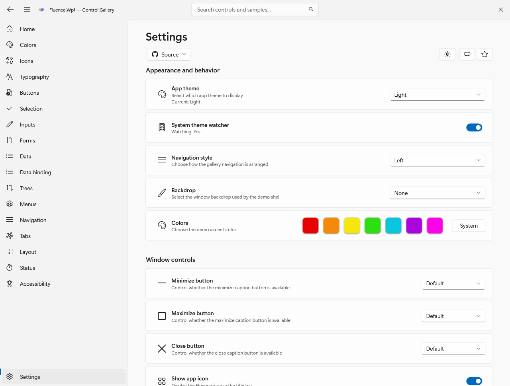
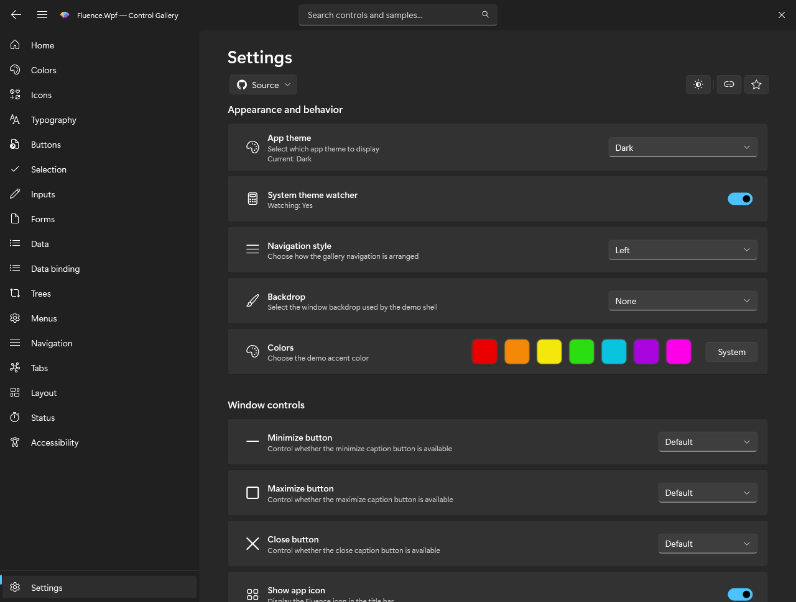

# How theme publication works

The application-facing explanation and supported resource key families are now together in [Theme Resources and publication](../theming.md). This deeper pipeline trace remains for readers who need the resolver and fingerprint stages.

The theme engine in `Fluence.Wpf/Theming/FluenceThemeEngine.cs` is the single path for theme and accent updates. `ApplicationThemeManager` and `ApplicationAccentColorManager` are public entry points that delegate to it.

## From request to resources

1. `ThemeResolver` turns `Auto`, Light, Dark, or High Contrast into a concrete theme. `Auto` reads Windows app settings.
2. `AccentResolver` chooses the current accent intent. The default is the Windows palette, with fallbacks if its registry values are unavailable. A custom intent carries one seed or separate light and dark seeds.
3. `ColorMap` combines the selected theme's color table with accent-derived colors and window chrome colors.
4. `PublishFingerprint` compares the resolved output with the last published output. It also captures live high contrast system colors and the Windows transparency setting, because they can change output or backdrop behavior without a change in the ordinary color map.
5. When publication is needed, `BrushFactory` creates a fresh dictionary containing colors and frozen brush counterparts. `SpecialBrushes` adds gradients, high contrast overrides, and brush-only roles.
6. The engine replaces `Application.Current.Resources.MergedDictionaries[0]` with that dictionary. Existing `DynamicResource` references resolve again.

Typography and generic control templates occupy slots `[1]` and `[2]` and are loaded once. The [resource reference](../theming.md) lists the supported keys and their aliases.

For a changed publish after initialization, the engine raises an internal preparing event before replacing slot `[0]`. A realized `FluenceWindow` can capture its current WPF surface, then the engine publishes the new frozen dictionary normally. After the synchronous change handlers finish, a 167 ms fade removes that snapshot and reveals the new appearance. This overlay does not animate brushes or delay public state and change events. Initial publication and redundant fingerprint matches do not start a transition. High Contrast entry and exit, disabled motion, minimized or unrealized windows, and failed or oversized captures skip it. A regular WPF `Window` has no Fluence overlay and changes immediately. Native DWM backdrop pixels are outside the WPF snapshot, so backdrop material itself cannot be interpolated.

## Why duplicate applies are skipped

Windows can broadcast several related settings messages for one user action. Rebuilding every brush and notifying every dynamic resource consumer for an unchanged result would create unnecessary work. The fingerprint gate skips that publish. If `Application.Current` is unavailable, no successful fingerprint is recorded, so a later apply can retry.

`ApplicationThemeManager.CurrentTheme` and `CurrentBackdrop` record the caller's request even when the resolved resource values stay the same. Its `Changed` event still fires for a changed request, including a backdrop-only change. Accent apply methods bypass that facade and raise `AccentColorChanged` only when the theme engine publishes. A theme apply that publishes also raises `AccentColorChanged`, because the accent manager listens to every engine publish.

## High contrast and design time

The gallery Settings route exposes theme and accent options. These captures show its light and dark presentations.

Button captures show the published resources after choosing a blue or orange custom accent.

The [screenshot manifest](../screenshots/gallery/manifest.json) records routes, themes, and changed states. It also notes that offscreen rendering omits native DWM shadows and backdrops.

High contrast is a concrete theme with live `SystemColors` brush roles. A settings change triggers another apply and publishes the new snapshot. Design-time Light and Dark dictionaries are generated snapshots so XAML tooling can show a preview without executing the runtime pipeline. They do not replace runtime application resources.
