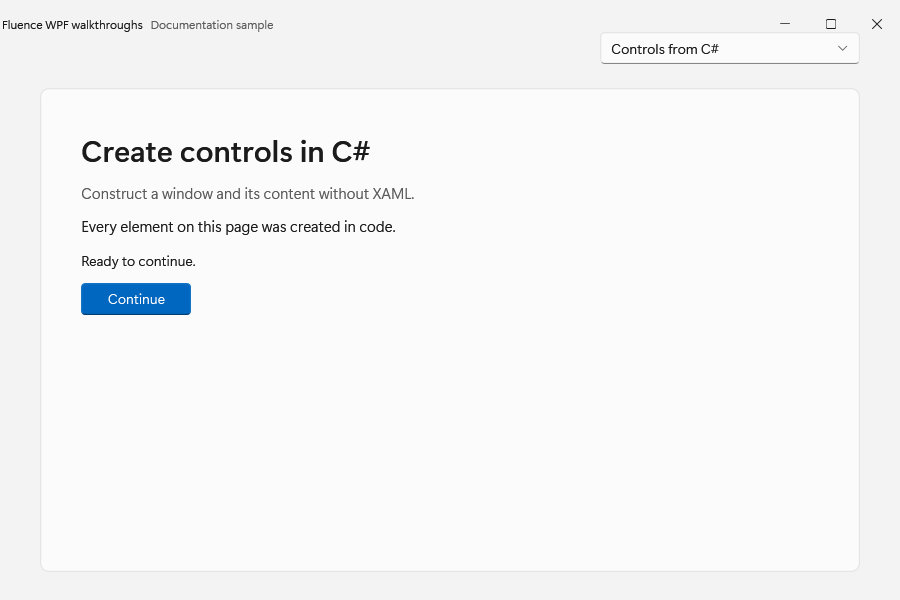
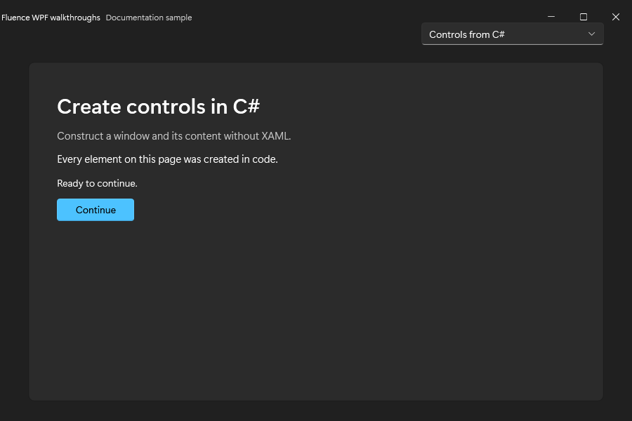

# Creating controls programmatically

This walkthrough builds the same simple window shape as [Basic Usage](../csharp/usage.md) directly in C#. It uses dynamic resource references so controls created in code also respond to theme changes.


Fluence controls can be created directly in C#, bound to a view model, or declared in XAML with C# event handlers. Initialize the application theme before constructing the visual tree, as shown in the [first WPF app tutorial](../tutorials/first-wpf-app.md).

The [C# API reference](../api/index.md) lists each type's constructors, properties, methods, events, and related types. The [control catalog](../controls.md) provides usage examples and screenshots.

## Choose the correct control namespace

Many Fluence controls share a name with a WPF control. Use an alias when your file needs both libraries:

```csharp
using System.Windows;
using Fluence.Wpf;
using Controls = Fluence.Wpf.Controls;
```

`Controls.Button` is the Fluence button. `System.Windows.Controls.Button` is the framework button. Check the inheritance declaration on each API page: some Fluence types extend the corresponding WPF control, while others have a different base type and their own properties.

## Build a window without XAML

This `MainWindow` constructs its content in C#. Use it with the application's `OnStartup` from the [first app tutorial](../tutorials/first-wpf-app.md#2-initialize-the-theme-before-the-first-window). For this version, remove the template's `MainWindow.xaml` and replace its code-behind with `MainWindow.cs` below. Do not call `InitializeComponent`; the constructor creates the visual tree.

```csharp
using System.Windows;
using Fluence.Wpf;
using Controls = Fluence.Wpf.Controls;

namespace MyApp
{
    public sealed class MainWindow : Controls.FluenceWindow
    {
        public MainWindow()
        {
            Title = "My Fluent application";
            Width = 640;
            Height = 400;
            SystemBackdropType = WindowBackdropType.Auto;
            ExtendsContentIntoTitleBar = true;
            TitleBar = new Controls.TitleBar { Title = Title };
            SetResourceReference(BackgroundProperty, "ApplicationBackgroundBrush");

            Controls.TextBlock status = new() { Text = "Ready to continue." };
            Controls.Button button = new()
            {
                Content = "Continue",
                Appearance = ControlAppearance.Accent,
                HorizontalAlignment = HorizontalAlignment.Left,
            };
            button.Click += (_, _) => status.Text = "The button was clicked.";

            Controls.StackPanel panel = new()
            {
                Margin = new Thickness(24),
                Spacing = 16,
            };
            panel.Children.Add(status);
            panel.Children.Add(button);
            Content = panel;
        }
    }
}
```

The button inherits WPF's `Click` event and command support. `Appearance` is a Fluence property. The stack panel's `Spacing` property adds space between children. See [FluenceWindow](../controls/fluence-window.md), [Button](../controls/button.md), and [StackPanel](../controls/stack-panel.md) for their visual examples.

The code-created window in both themes:





## Bind a dependency property

Use WPF bindings with Fluence dependency properties. For example, this text box reads and updates a `DisplayName` property on its inherited `DataContext`:

```csharp
Controls.TextBox nameInput = new()
{
    PlaceholderText = "Display name",
};
nameInput.SetBinding(
    Controls.TextBox.TextProperty,
    new System.Windows.Data.Binding("DisplayName")
    {
        Mode = System.Windows.Data.BindingMode.TwoWay,
        UpdateSourceTrigger = System.Windows.Data.UpdateSourceTrigger.PropertyChanged,
    });
```

Set the window or container's `DataContext` to your view model. Implement `INotifyPropertyChanged` on that view model when changes made in code must update the UI. Use `ICommand` bindings for actions in an MVVM application; the [MVVM sample](../../Fluence.Wpf.Demo.Mvvm/README.md) shows a complete application.

## Keep resource references responsive to theme changes

`SetResourceReference` is the C# counterpart of a XAML `DynamicResource` reference. It lets WPF resolve a new brush after a theme or accent change:

```csharp
Controls.Border surface = new();
surface.SetResourceReference(
    Controls.Border.BackgroundProperty,
    "CardBackgroundFillColorDefaultBrush");
```

Assigning a brush fetched once from `FindResource` stores that brush instance. It does not establish a dynamic resource reference. Prefer `SetResourceReference` for theme-dependent values and use the published keys in the [theme resource reference](../theming.md).

## Apply attached properties to native controls

Some features extend an existing WPF type instead of introducing a new control. `PasswordBox` is sealed, so Fluence exposes its additions through `PasswordBoxExtensions`:

```csharp
System.Windows.Controls.PasswordBox password = new();
Controls.PasswordBoxExtensions.SetPlaceholderText(password, "Enter your password");
Controls.PasswordBoxExtensions.SetShowCapsLockIndicator(password, true);
```

The generated [PasswordBoxExtensions API](../api/Fluence.Wpf.Controls/PasswordBoxExtensions.md) documents the attached-property getters, setters, and dependency-property identifiers.

## Update controls on their UI dispatcher

Construct and update WPF controls on the UI thread. When background work finishes, marshal the update to the dispatcher that owns the control:

```csharp
await status.Dispatcher.InvokeAsync(() =>
{
    status.Text = "Finished.";
});
```

Here `status` is the text block being updated. Keep long-running work out of event handlers on the UI thread. For modal asynchronous UI, use [ContentDialog](../controls/content-dialog.md) and await its result from a UI event handler.

## Read the API reference

- A type's declaration shows its namespace, base type, and implemented interfaces.
- Properties describe the value you set or read. Dependency-property fields expose the identifiers used for binding, resource references, and metadata.
- Overloads have separate signatures and parameter descriptions. Use the signature that matches your arguments.
- Protected members are extension points for derived classes, not methods to call on a control instance from application code.
- Inherited WPF members remain available even when a reference page focuses on members declared by Fluence.

Start with the [API index](../api/index.md) or return to the [control catalog](../controls.md).
