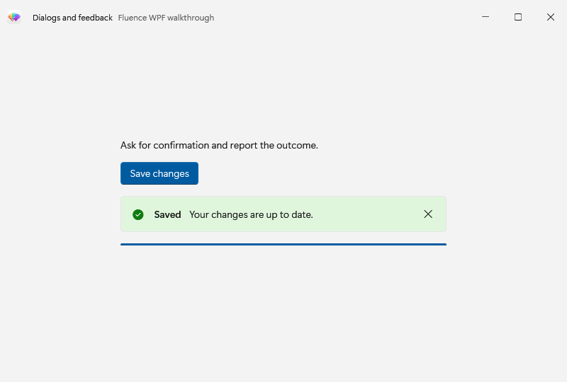
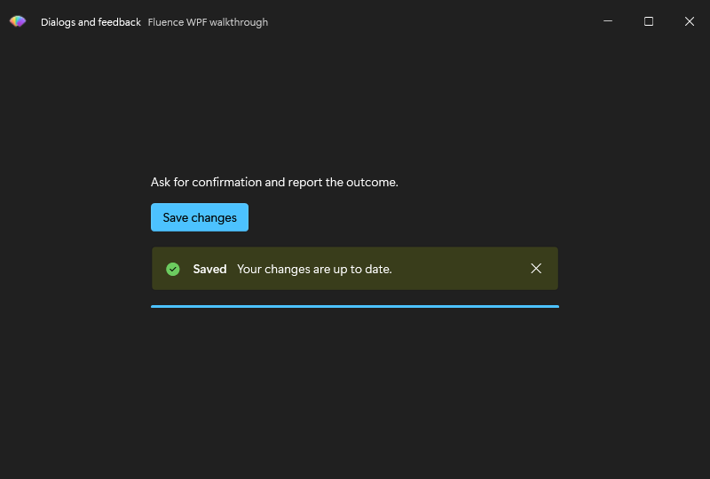

# Show a dialog and feedback

This standalone window asks the user to confirm a sample save, then shows the outcome inline with `InfoBar` and `ProgressBar`. Begin with the [Basic walkthrough](../csharp/usage.md) theme setup, then run this example from the Website repository root. The first command restores and builds against the explicit local package source; the second runs the example:

~~~powershell
pwsh ./samples/Fluence.Wpf.Docs.Walkthroughs/Build-Walkthroughs.ps1 -PackageSource ./samples/Fluence.Wpf.Docs.Walkthroughs/packages
dotnet run --project ./samples/Fluence.Wpf.Docs.Walkthroughs/Fluence.Wpf.Docs.Walkthroughs.csproj -c Release --no-build -- --example dialogs-and-feedback
~~~

## Declare the window

The complete layout is in [DialogsAndFeedbackWindow.xaml](https://github.com/sintaxasn/Fluence.Wpf.Website/blob/main/samples/Fluence.Wpf.Docs.Walkthroughs/DialogsAndFeedbackWindow.xaml). The icon URI points to a resource in the sample project; use your own resource when copying the window.

~~~xml
<fluence:FluenceWindow
    x:Class="Fluence.Wpf.Docs.Walkthroughs.DialogsAndFeedbackWindow"
    xmlns="http://schemas.microsoft.com/winfx/2006/xaml/presentation"
    xmlns:x="http://schemas.microsoft.com/winfx/2006/xaml"
    xmlns:fluence="http://schemas.fluencewpf.com"
    Title="Dialogs and feedback"
    Icon="/Fluence.Wpf.Docs.Walkthroughs;component/Fluence_Icon.ico"
    Width="800" Height="540" MinWidth="640" MinHeight="420"
    WindowStartupLocation="CenterScreen"
    Background="{DynamicResource ApplicationBackgroundBrush}"
    SystemBackdropType="Mica"
    ExtendsContentIntoTitleBar="True">
    <fluence:FluenceWindow.TitleBar>
        <fluence:TitleBar Title="Dialogs and feedback" Subtitle="Fluence WPF walkthrough">
            <fluence:TitleBar.Icon>
                <Image Width="20" Height="20" Source="/Fluence.Wpf.Docs.Walkthroughs;component/Fluence_Icon.ico" />
            </fluence:TitleBar.Icon>
        </fluence:TitleBar>
    </fluence:FluenceWindow.TitleBar>
    <fluence:StackPanel Width="460" HorizontalAlignment="Center" VerticalAlignment="Center" Spacing="16">
        <fluence:TextBlock Text="Ask for confirmation and report the outcome." />
        <fluence:Button Content="Save changes" Appearance="Accent" Click="Save_Click"
                        HorizontalAlignment="Left" />
        <fluence:InfoBar x:Name="SaveInfo" Title="Ready" Message="No changes saved yet."
                         IsOpen="True" />
        <fluence:ProgressBar x:Name="SaveProgress" Value="0" />
    </fluence:StackPanel>
</fluence:FluenceWindow>
~~~

## Wire the interaction

[DialogsAndFeedbackWindow.xaml.cs](https://github.com/sintaxasn/Fluence.Wpf.Website/blob/main/samples/Fluence.Wpf.Docs.Walkthroughs/DialogsAndFeedbackWindow.xaml.cs) contains the code-behind. The `x:Class` in XAML and the partial class name in C# must match.

~~~csharp
using System;
using System.Windows;
using System.Threading.Tasks;
using Fluence.Wpf.Controls;
namespace Fluence.Wpf.Docs.Walkthroughs
{
    public sealed partial class DialogsAndFeedbackWindow : FluenceWindow
    {
        internal DialogsAndFeedbackWindow()
        {
            InitializeComponent();
        }

        private void Save_Click(object sender, RoutedEventArgs e)
        {
            _ = SaveAsync();
        }

        private async Task SaveAsync()
        {
            ContentDialog dialog = new()
            {
                Title = "Save changes?",
                Content = "Confirm the sample save action.",
                PrimaryButtonText = "Save",
                CloseButtonText = "Cancel",
            };
            try
            {
                ContentDialogResult result = await dialog.ShowAsync().ConfigureAwait(true);
                if (result is ContentDialogResult.Primary)
                {
                    ShowSaved();
                }
                else
                {
                    SaveInfo.Title = "Canceled";
                    SaveInfo.Message = "No changes were saved.";
                    SaveInfo.Severity = InfoBarSeverity.Informational;
                }
            }
            catch (InvalidOperationException ex)
            {
                ShowSaveError(ex.Message);
            }
            catch (OperationCanceledException ex)
            {
                ShowSaveError(ex.Message);
            }
        }

        private void ShowSaveError(string message)
        {
            SaveInfo.Title = "Save failed";
            SaveInfo.Message = message;
            SaveInfo.Severity = InfoBarSeverity.Error;
        }

        private void ShowSaved()
        {
            SaveProgress.Value = 100;
            SaveInfo.Title = "Saved";
            SaveInfo.Message = "Your changes are up to date.";
            SaveInfo.Severity = InfoBarSeverity.Success;
        }

        internal void PrepareCapture()
        {
            ShowSaved();
        }
    }
}
~~~

`fluence:StackPanel` spaces the button, `InfoBar`, and progress indicator. `Save_Click` starts `SaveAsync`, which awaits `ContentDialog.ShowAsync()` and uses the result to update feedback. Confirming sets progress to 100 and reports success; canceling reports that nothing was saved. `InvalidOperationException` and `OperationCanceledException` are caught and shown in `InfoBar`. The example changes UI state only and does not write a file. `PrepareCapture` is used only for repeatable documentation screenshots.

## See the result

See [ContentDialog](../controls/content-dialog.md), [InfoBar](../controls/info-bar.md), and the [control catalog](../controls.md) for adjacent feedback controls.
