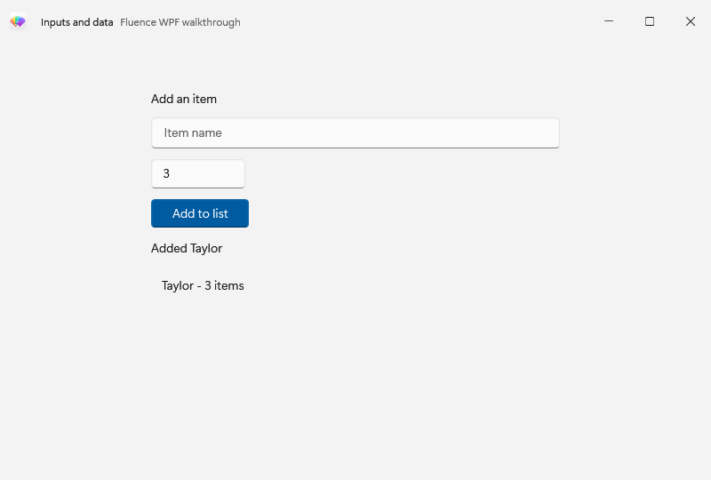
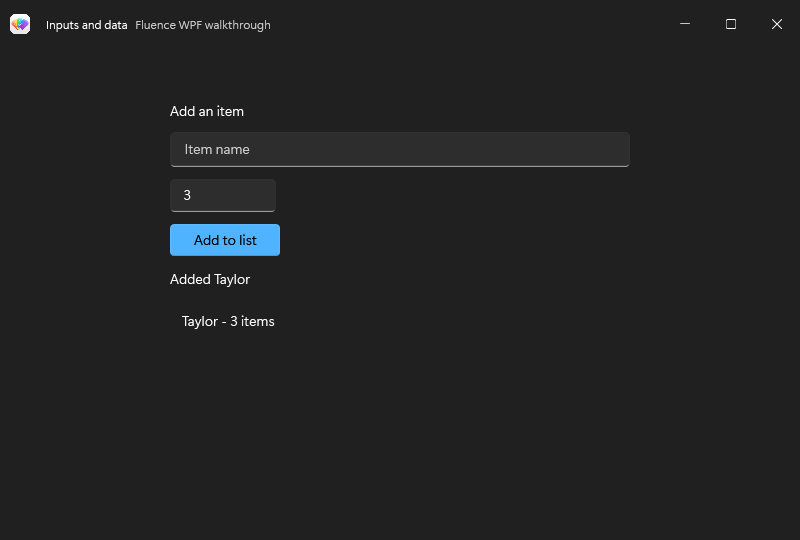

# Use inputs and data controls

This standalone form accepts an item name and quantity, validates them, and displays each submitted entry in a Fluence list. Begin with the [Basic walkthrough](../csharp/usage.md) theme setup, then run this example from the Website repository root. The first command restores and builds against the explicit local package source; the second runs the example:

~~~powershell
pwsh ./samples/Fluence.Wpf.Docs.Walkthroughs/Build-Walkthroughs.ps1 -PackageSource ./samples/Fluence.Wpf.Docs.Walkthroughs/packages
dotnet run --project ./samples/Fluence.Wpf.Docs.Walkthroughs/Fluence.Wpf.Docs.Walkthroughs.csproj -c Release --no-build -- --example inputs-and-data
~~~

## Declare the window

The complete layout is in [InputsAndDataWindow.xaml](https://github.com/sintaxasn/Fluence.Wpf.Website/blob/main/samples/Fluence.Wpf.Docs.Walkthroughs/InputsAndDataWindow.xaml). The icon URI points to a resource in the sample project; use your own resource when copying this window.

~~~xml
<fluence:FluenceWindow
    x:Class="Fluence.Wpf.Docs.Walkthroughs.InputsAndDataWindow"
    xmlns="http://schemas.microsoft.com/winfx/2006/xaml/presentation"
    xmlns:x="http://schemas.microsoft.com/winfx/2006/xaml"
    xmlns:fluence="http://schemas.fluencewpf.com"
    Title="Inputs and data"
    Icon="/Fluence.Wpf.Docs.Walkthroughs;component/Fluence_Icon_Light.ico"
    Width="800" Height="540" MinWidth="640" MinHeight="420"
    WindowStartupLocation="CenterScreen"
    Background="{DynamicResource ApplicationBackgroundBrush}"
    SystemBackdropType="Mica"
    ExtendsContentIntoTitleBar="True">
    <fluence:FluenceWindow.TitleBar>
        <fluence:TitleBar Title="Inputs and data" Subtitle="Fluence WPF walkthrough">
            <fluence:TitleBar.Icon>
                <Image Width="20" Height="20" Source="/Fluence.Wpf.Docs.Walkthroughs;component/Fluence_Icon_Light.ico" />
            </fluence:TitleBar.Icon>
        </fluence:TitleBar>
    </fluence:FluenceWindow.TitleBar>
    <fluence:StackPanel Width="460" HorizontalAlignment="Center" VerticalAlignment="Center" Spacing="12">
        <fluence:TextBlock Text="Add an item" />
        <fluence:TextBox x:Name="ItemName" PlaceholderText="Item name" />
        <fluence:NumberBox x:Name="Quantity" PlaceholderText="Quantity" Value="1" />
        <fluence:Button Content="Add to list" Click="AddItem_Click" Appearance="Accent"
                        HorizontalAlignment="Left" />
        <fluence:TextBlock x:Name="InputStatus" />
        <fluence:ListView x:Name="ItemsList" Height="140" ItemsSource="{Binding Entries}" />
    </fluence:StackPanel>
</fluence:FluenceWindow>
~~~

## Wire the interaction

[InputsAndDataWindow.xaml.cs](https://github.com/sintaxasn/Fluence.Wpf.Website/blob/main/samples/Fluence.Wpf.Docs.Walkthroughs/InputsAndDataWindow.xaml.cs) contains the code-behind. The `x:Class` in XAML and the partial class name in C# must match.

~~~csharp
using System;
using System.Collections.ObjectModel;
using System.Globalization;
using System.Windows;
using Fluence.Wpf.Controls;
namespace Fluence.Wpf.Docs.Walkthroughs
{
    public sealed partial class InputsAndDataWindow : FluenceWindow
    {
        public ObservableCollection<string> Entries { get; } = [];

        internal InputsAndDataWindow()
        {
            InitializeComponent();
            DataContext = this;
        }

        private void AddItem_Click(object sender, RoutedEventArgs e)
        {
            AddItem();
        }

        private void AddItem()
        {
            if (string.IsNullOrWhiteSpace(ItemName.Text) || double.IsNaN(Quantity.Value) ||
                Quantity.Value <= 0 || Math.Abs(Quantity.Value - Math.Round(Quantity.Value, MidpointRounding.AwayFromZero)) > 0.000001)
            {
                InputStatus.Text = "Enter a name and a positive whole quantity.";
                return;
            }

            Entries.Add(ItemName.Text.Trim() + " - " + Quantity.Value.ToString("0", CultureInfo.CurrentCulture) + " items");
            InputStatus.Text = "Added " + ItemName.Text.Trim();
            ItemName.Text = string.Empty;
        }

        internal void PrepareCapture()
        {
            ItemName.Text = "Taylor";
            Quantity.Value = 3;
            AddItem();
        }
    }
}
~~~

`fluence:StackPanel` gives the form fields a 12-pixel gap. `Entries` is an `ObservableCollection<string>`. The constructor assigns the window as `DataContext`, so `ItemsSource="{Binding Entries}"` resolves to that collection. WPF observes new entries and updates the list. `AddItem_Click` rejects an empty name, a nonnumber, and quantities that are not positive whole numbers. On success it adds a formatted entry and clears the name field.

## See the result

See the [control catalog](../controls.md) for other inputs and the [data binding gallery](https://github.com/sintaxasn/Fluence.Wpf/blob/main/Fluence.Wpf.Demo/Pages/GalleryDataBindingPage.xaml) for more collection examples.
