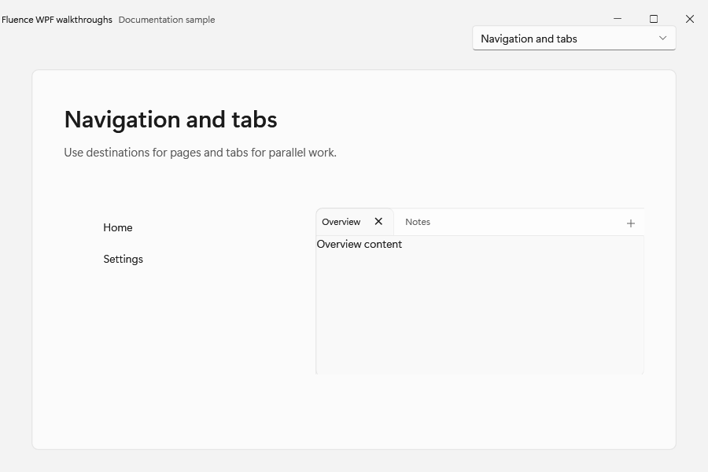
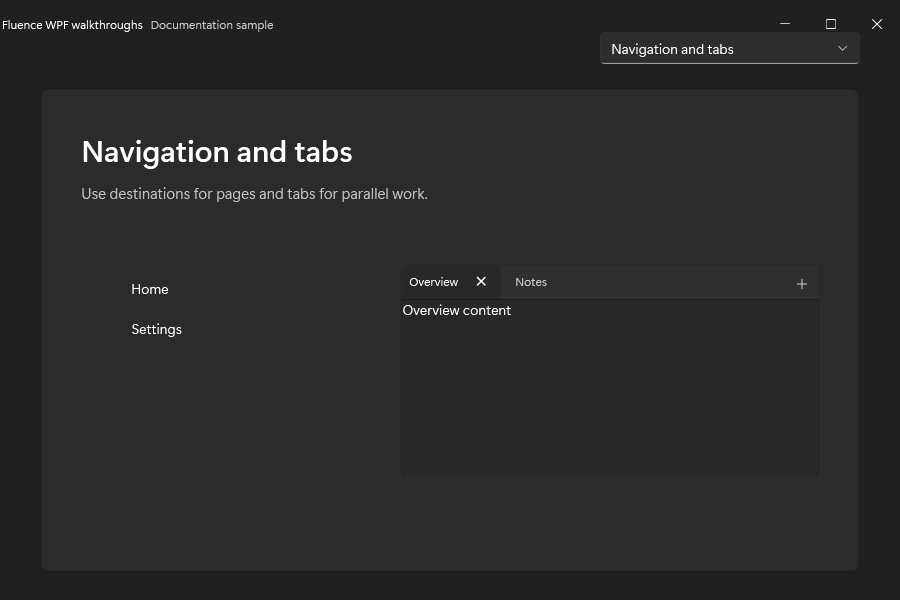

# Add Navigation and tabs

Build a two-destination shell and place tabbed content on one destination. The [Basic Usage](../csharp/usage.md) window provides the theme startup and title bar.


Use `NavigationView` for the application's main destinations and `TabView` for documents or parallel workspaces. Both are normal WPF controls with Fluence templates.

## Host page content in NavigationView


`NavigationView` derives from `Selector`. Put destination items in its item collection and place the active page in its `Content` property. A bare `Frame` child would be treated as an item, so use the property element:

```xml
<fluence:NavigationView xmlns="http://schemas.microsoft.com/winfx/2006/xaml/presentation"
                        xmlns:x="http://schemas.microsoft.com/winfx/2006/xaml"
                        xmlns:fluence="http://schemas.fluencewpf.com"
                        PaneDisplayMode="Left"
                        IsPaneOpen="True"
                        ItemInvoked="OnItemInvoked">
    <fluence:NavigationViewItem Content="Home" Tag="home" />
    <fluence:NavigationViewItem Content="Settings" Tag="settings" />
    <fluence:NavigationView.Content>
        <Frame x:Name="PageFrame" NavigationUIVisibility="Hidden" />
    </fluence:NavigationView.Content>
</fluence:NavigationView>
```

Handle `ItemInvoked` to navigate the content frame. The event fires before selection changes. `BackRequested` is separate from selection, and the application owns its navigation history. The [gallery shell](../../Fluence.Wpf.Demo/MainWindow.xaml) shows a complete implementation, including pinned footer items and a title-bar search box.

`PaneDisplayMode` selects left or top navigation. `IsPaneOpen` controls expansion in left modes. `FooterMenuItems` holds destinations pinned below the scrolling menu.

## Add closable tabs

`TabView` extends WPF `TabControl`; use `TabViewItem` for each tab. `TabCloseRequested` reports a close request, so your application decides whether to remove the item or ask the user to save work. `AddTabButtonClick` reports the optional add button, and `IsAddTabButtonVisible` controls its display.

```xml
<fluence:TabView xmlns="http://schemas.microsoft.com/winfx/2006/xaml/presentation"
                 xmlns:fluence="http://schemas.fluencewpf.com"
                 IsAddTabButtonVisible="True"
                 AddTabButtonClick="OnAddTab"
                 TabCloseRequested="OnTabCloseRequested">
    <fluence:TabViewItem Header="Overview">
        <TextBlock Text="Overview content" />
    </fluence:TabViewItem>
</fluence:TabView>
```

The navigation shell and tabs in both themes:





See the [tab gallery page](../../Fluence.Wpf.Demo/Pages/GalleryTabsPage.xaml) for data-bound and closeable examples. The [control catalog](../controls.md) covers adjacent navigation controls such as `BreadcrumbBar`, `PipsPager`, and `SelectorBar`.
