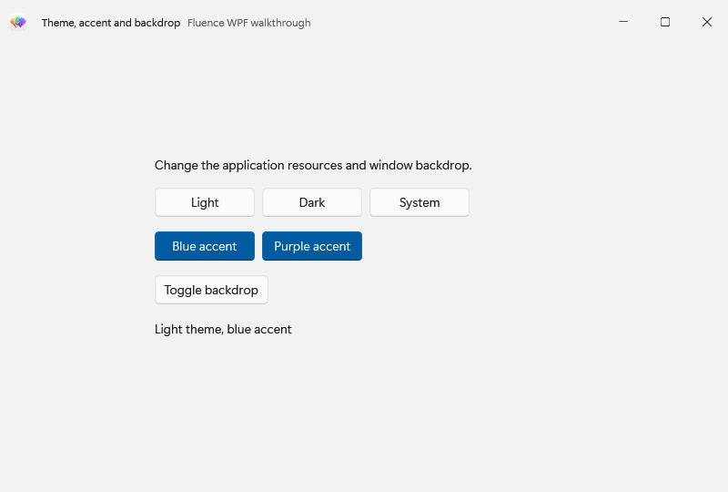
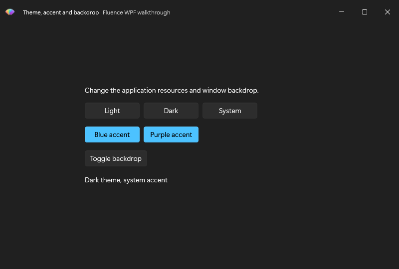

# Change theme, accent and backdrop

This standalone window lets you change the application theme and accent, then toggle this window's backdrop. Its buttons make the difference between application resources and a window property visible. Begin with the [Basic walkthrough](../csharp/usage.md) theme setup, then run this example from the Website repository root. The first command restores and builds against the explicit local package source; the second runs the example:

~~~powershell
pwsh ./samples/Fluence.Wpf.Docs.Walkthroughs/Build-Walkthroughs.ps1 -PackageSource ./samples/Fluence.Wpf.Docs.Walkthroughs/packages
dotnet run --project ./samples/Fluence.Wpf.Docs.Walkthroughs/Fluence.Wpf.Docs.Walkthroughs.csproj -c Release --no-build -- --example theme-and-accent
~~~

## Declare the window

The complete layout is in [ThemeAndAccentWindow.xaml](https://github.com/sintaxasn/Fluence.Wpf.Website/blob/main/samples/Fluence.Wpf.Docs.Walkthroughs/ThemeAndAccentWindow.xaml). The icon URI points to a resource in the sample project; use your own resource when copying this window.

~~~xml
<fluence:FluenceWindow
    x:Class="Fluence.Wpf.Docs.Walkthroughs.ThemeAndAccentWindow"
    xmlns="http://schemas.microsoft.com/winfx/2006/xaml/presentation"
    xmlns:x="http://schemas.microsoft.com/winfx/2006/xaml"
    xmlns:fluence="http://schemas.fluencewpf.com"
    Title="Theme, accent and backdrop"
    Icon="/Fluence.Wpf.Docs.Walkthroughs;component/Fluence_Icon.ico"
    Width="800" Height="540" MinWidth="640" MinHeight="420"
    WindowStartupLocation="CenterScreen"
    Background="{DynamicResource ApplicationBackgroundBrush}"
    SystemBackdropType="Mica"
    ExtendsContentIntoTitleBar="True">
    <fluence:FluenceWindow.TitleBar>
        <fluence:TitleBar Title="Theme, accent and backdrop" Subtitle="Fluence WPF walkthrough">
            <fluence:TitleBar.Icon>
                <Image Width="20" Height="20" Source="/Fluence.Wpf.Docs.Walkthroughs;component/Fluence_Icon.ico" />
            </fluence:TitleBar.Icon>
        </fluence:TitleBar>
    </fluence:FluenceWindow.TitleBar>
    <fluence:StackPanel Width="460" HorizontalAlignment="Center" VerticalAlignment="Center" Spacing="16">
        <fluence:TextBlock Text="Change the application resources and window backdrop." />
        <WrapPanel>
            <fluence:Button Content="Light" Click="Light_Click" Margin="0,0,8,0" />
            <fluence:Button Content="Dark" Click="Dark_Click" Margin="0,0,8,0" />
            <fluence:Button Content="System" Click="System_Click" />
        </WrapPanel>
        <WrapPanel>
            <fluence:Button Content="Blue accent" Appearance="Accent" Click="Blue_Click" Margin="0,0,8,0" />
            <fluence:Button Content="Purple accent" Appearance="Accent" Click="Purple_Click" />
        </WrapPanel>
        <fluence:Button Content="Toggle backdrop" Click="Backdrop_Click"
                        HorizontalAlignment="Left" />
        <fluence:TextBlock x:Name="ThemeStatus" />
    </fluence:StackPanel>
</fluence:FluenceWindow>
~~~

## Wire the interaction

[ThemeAndAccentWindow.xaml.cs](https://github.com/sintaxasn/Fluence.Wpf.Website/blob/main/samples/Fluence.Wpf.Docs.Walkthroughs/ThemeAndAccentWindow.xaml.cs) contains the code-behind. The `x:Class` in XAML and the partial class name in C# must match.

~~~csharp
using System.Windows;
using System.Windows.Media;
using Fluence.Wpf.Controls;
namespace Fluence.Wpf.Docs.Walkthroughs
{
    public sealed partial class ThemeAndAccentWindow : FluenceWindow
    {
        internal ThemeAndAccentWindow()
        {
            InitializeComponent();
            ThemeStatus.Text = "Following system theme and accent";
        }

        internal void PrepareCapture(ApplicationTheme theme)
        {
            ThemeStatus.Text = theme + " theme, blue accent";
        }

        private void Light_Click(object sender, RoutedEventArgs e)
        {
            ApplicationThemeManager.Apply(ApplicationTheme.Light);
            ThemeStatus.Text = "Light theme";
        }

        private void Dark_Click(object sender, RoutedEventArgs e)
        {
            ApplicationThemeManager.Apply(ApplicationTheme.Dark);
            ThemeStatus.Text = "Dark theme";
        }

        private void System_Click(object sender, RoutedEventArgs e)
        {
            ApplicationThemeManager.Apply(ApplicationTheme.Auto);
            ApplicationAccentColorManager.ApplySystemAccent();
            ThemeStatus.Text = "System theme and accent";
        }

        private void Blue_Click(object sender, RoutedEventArgs e)
        {
            ApplicationAccentColorManager.ApplyCustomAccent(Color.FromRgb(0x00, 0x78, 0xD4));
            ThemeStatus.Text = "Blue accent";
        }

        private void Purple_Click(object sender, RoutedEventArgs e)
        {
            ApplicationAccentColorManager.ApplyCustomAccent(Color.FromRgb(0x88, 0x57, 0xB7));
            ThemeStatus.Text = "Purple accent";
        }

        private void Backdrop_Click(object sender, RoutedEventArgs e)
        {
            SystemBackdropType = SystemBackdropType is WindowBackdropType.Mica
                ? WindowBackdropType.None
                : WindowBackdropType.Mica;
            ThemeStatus.Text = "Backdrop: " + SystemBackdropType;
        }
    }
}
~~~

`fluence:StackPanel` provides a 16-pixel gap between the controls and button rows. The Light, Dark, and System handlers call `ApplicationThemeManager.Apply`. The System handler also returns to the Windows accent with `ApplySystemAccent`; the blue and purple buttons pin a custom accent. Their `Appearance="Accent"` makes the active accent visible on both buttons as it changes. `Backdrop_Click` changes this window's `SystemBackdropType` between `Mica` and `None`. Calling the theme manager's backdrop overload alone would not set a window's backdrop.

## See the result

See the [theme resource reference](../theming.md) and [theme pipeline](../explanation/theme-pipeline.md) for the resource keys and publish behavior.
