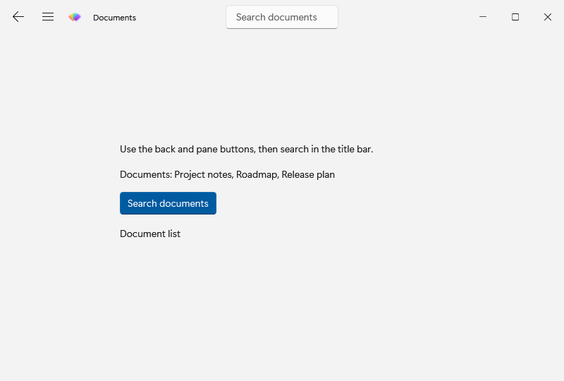
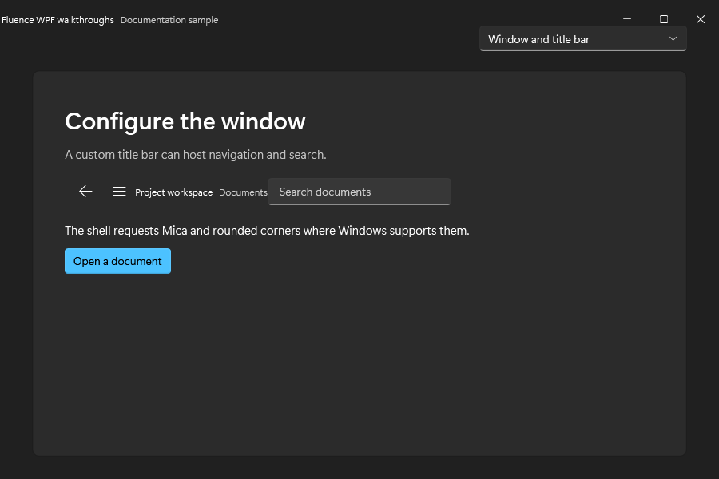

# Configure a window and title bar

This standalone window shows how to put controls in a `FluenceWindow` title bar and respond to its requests. It has a back button, a pane toggle button, and a search box in the chrome. Begin with the [Basic walkthrough](../csharp/usage.md) theme setup, then run this example from the Website repository root. The first command restores and builds against the explicit local package source; the second runs the example:

~~~powershell
pwsh ./samples/Fluence.Wpf.Docs.Walkthroughs/Build-Walkthroughs.ps1 -PackageSource ./samples/Fluence.Wpf.Docs.Walkthroughs/packages
dotnet run --project ./samples/Fluence.Wpf.Docs.Walkthroughs/Fluence.Wpf.Docs.Walkthroughs.csproj -c Release --no-build -- --example window-and-title-bar
~~~

## Declare the window

The complete layout is in [WindowAndTitleBarWindow.xaml](https://github.com/sintaxasn/Fluence.Wpf.Website/blob/main/samples/Fluence.Wpf.Docs.Walkthroughs/WindowAndTitleBarWindow.xaml). The icon URI points to a resource in the sample project; use your own resource when copying this window.

~~~xml
<fluence:FluenceWindow
    x:Class="Fluence.Wpf.Docs.Walkthroughs.WindowAndTitleBarWindow"
    xmlns="http://schemas.microsoft.com/winfx/2006/xaml/presentation"
    xmlns:x="http://schemas.microsoft.com/winfx/2006/xaml"
    xmlns:fluence="http://schemas.fluencewpf.com"
    Title="Window and title bar"
    Icon="/Fluence.Wpf.Docs.Walkthroughs;component/Fluence_Icon.ico"
    Width="800" Height="540" MinWidth="640" MinHeight="420"
    WindowStartupLocation="CenterScreen"
    Background="{DynamicResource ApplicationBackgroundBrush}"
    SystemBackdropType="Mica"
    ExtendsContentIntoTitleBar="True">
    <fluence:FluenceWindow.TitleBar>
        <fluence:TitleBar x:Name="ShellTitleBar" Title="Documents"
                          IsBackButtonVisible="True"
                          IsPaneToggleButtonVisible="True">
            <fluence:TitleBar.Icon>
                <Image Width="20" Height="20" Source="/Fluence.Wpf.Docs.Walkthroughs;component/Fluence_Icon.ico" />
            </fluence:TitleBar.Icon>
            <fluence:TitleBar.CustomContent>
                <fluence:TextBox x:Name="TitleSearch" Width="160" PlaceholderText="Search documents"
                                 WindowChrome.IsHitTestVisibleInChrome="True" />
            </fluence:TitleBar.CustomContent>
        </fluence:TitleBar>
    </fluence:FluenceWindow.TitleBar>
    <fluence:StackPanel Width="460" HorizontalAlignment="Center" VerticalAlignment="Center" Spacing="16">
        <fluence:TextBlock Text="Use the back and pane buttons, then search in the title bar."
                           TextWrapping="Wrap" />
        <fluence:TextBlock x:Name="DocumentsPane" Text="Documents: Project notes, Roadmap, Release plan" />
        <fluence:Button Content="Search documents" Appearance="Accent"
                        Click="OpenDocument_Click" HorizontalAlignment="Left" />
        <fluence:TextBlock x:Name="DocumentStatus" Text="Document list" />
    </fluence:StackPanel>
</fluence:FluenceWindow>
~~~

## Wire the interaction

[WindowAndTitleBarWindow.xaml.cs](https://github.com/sintaxasn/Fluence.Wpf.Website/blob/main/samples/Fluence.Wpf.Docs.Walkthroughs/WindowAndTitleBarWindow.xaml.cs) contains the code-behind. The `x:Class` in XAML and the partial class name in C# must match.

~~~csharp
using System.Windows;
using Fluence.Wpf.Controls;
namespace Fluence.Wpf.Docs.Walkthroughs
{
    public sealed partial class WindowAndTitleBarWindow : FluenceWindow
    {
        internal WindowAndTitleBarWindow()
        {
            InitializeComponent();
            ShellTitleBar.BackRequested += (_, _) =>
            {
                DocumentsPane.Visibility = Visibility.Visible;
                DocumentStatus.Text = "Document list";
            };
            ShellTitleBar.PaneToggleRequested += (_, _) =>
                DocumentsPane.Visibility = DocumentsPane.Visibility is Visibility.Visible
                    ? Visibility.Collapsed
                    : Visibility.Visible;
        }

        private void OpenDocument_Click(object sender, RoutedEventArgs e)
        {
            string query = TitleSearch.Text.Trim();
            DocumentStatus.Text = string.IsNullOrWhiteSpace(query)
                ? "Enter a search term in the title bar."
                : "Results for " + query;
            if (!string.IsNullOrWhiteSpace(query))
            {
                DocumentsPane.Visibility = Visibility.Collapsed;
            }
        }
    }
}
~~~

`TitleSearch` is placed in `TitleBar.CustomContent`. `WindowChrome.IsHitTestVisibleInChrome="True"` lets the text box receive input even though it sits in the draggable title area. `fluence:StackPanel` spaces the window content without margins on each child. The constructor handles `BackRequested` by returning to the document list and `PaneToggleRequested` by showing or hiding it. Selecting **Search documents** reads the search box and updates `DocumentStatus`; it does not open a file.

## See the result

See [FluenceWindow](../controls/fluence-window.md), [TitleBar](../controls/title-bar.md), and the [backdrop compatibility guide](../reference/compatibility.md).
