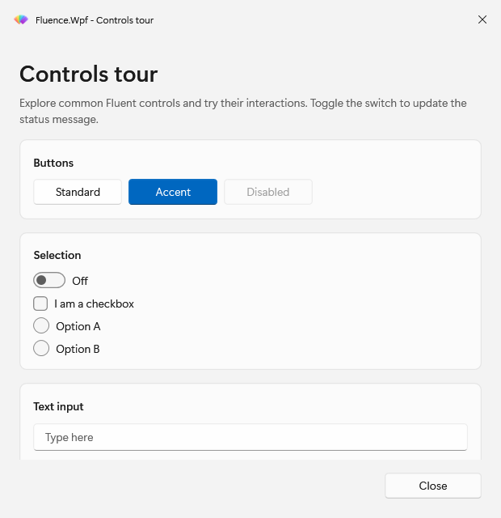
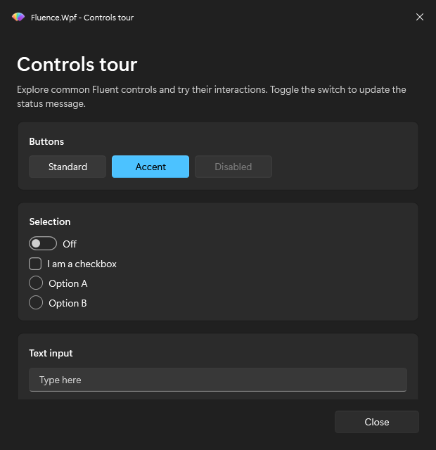

# PowerShell introduction

`Fluence.Wpf.PowerShell` gives Windows PowerShell scripts Fluent dialogs, forms, progress windows, and custom WPF windows. It uses the Fluence.Wpf control library and supports Windows PowerShell 5.1 and PowerShell 7.4 or later on Windows 10 version 1809 or later.

Start with [requirements](requirements.md), [installation](installation.md), and [basic usage](usage.md). Basic Usage takes you from importing the module to showing a message and reading a validated form result.

For a particular task, use the [walkthroughs](#walkthroughs). Browse [controls and dialogs](controls.md) to choose an interface, or open the [Functions Reference](reference/README.md) for parameters and return values.

## Walkthroughs

- [Show dialogs and messages](how-to/dialogs.md)
- [Build forms and validate answers](how-to/forms-and-validation.md)
- [Show progress during long work](how-to/progress.md)
- [Host a custom window from XAML](how-to/windows-from-xaml.md)
- [Change theme, accent, and backdrop](how-to/theming-at-runtime.md)
- [Use the module in an existing WPF host](how-to/use-in-existing-host.md)

The [runnable examples](../../Fluence.Wpf.PowerShell.Module/examples/README.md) provide complete scripts. [Architecture](explanation.md) explains the module's assembly and UI threading model, and [Contributing](contributing.md) covers source changes.

The ControlsTour example shows the module's windows in both themes.

