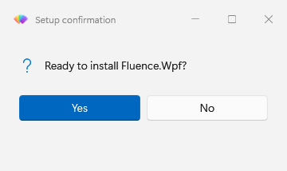
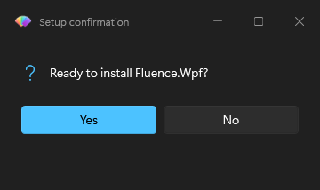
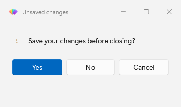
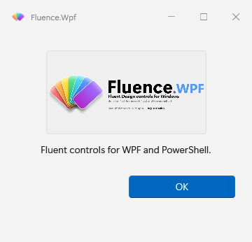
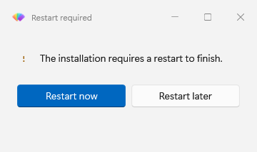
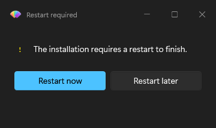

# Show messages and dialogs

Use this guide after [importing the module](../tutorial.md). It covers responses, custom actions, timers, images, placement, and restart decisions.

## Ask a question

`Show-FluenceMessage` returns the selected button name. Choose `OK`, `OKCancel`, `YesNo`, or `YesNoCancel` with `-Buttons`.

```powershell
$answer = Show-FluenceMessage -Title 'Update' -Message 'Install now?' -Icon Question -Buttons YesNo
if ($answer -eq 'Yes')
{
    Start-Update
}
```

Esc and the title bar close button return the cancel button, or the last button if the preset has no cancel button. For `YesNo`, a dismiss returns `No`; for `OK`, it returns `OK`. The command always returns a button name. An array passed to `-Message` displays as separate paragraphs.

## Choose a default action

The message dialog is shown in both themes here.





The first preset button is the default unless `-DefaultButton` names another button in that preset. Enter activates it. Make an irreversible action opt in:

```powershell
$answer = Show-FluenceMessage -Message 'Delete local data?' -Icon Warning -Buttons YesNo -DefaultButton No
```

`-Icon` accepts `None`, `Info`, `Success`, `Warning`, `Error`, and `Question`. Messages default to `Info`; general dialogs default to `None`.

This warning example shows the `Warning` body glyph and brush in light mode.



## Customize the title bar

Window-opening commands accept `-TitleBarIcon` for the host window icon. Supply a local path, `file:` URI, or `pack:` URI. `-Title` sets the title-bar text; `-TitleBarText` is an alias for it. For example:

```powershell
Show-FluenceMessage -Title 'Deployment status' -TitleBarIcon "$PSScriptRoot\assets\app.ico" -Message 'Ready to install.' -Icon Success
```

`-Icon` remains the severity or question glyph inside the dialog body, and `-Image` adds a body image. Dialog commands do not expose `-ShowIcon`; that switch is available on `Show-FluenceWindow` to hide its built-in host icon.

## Add custom actions

`Show-FluenceDialog` accepts button names or `New-FluenceButton` specifications. Give each action a stable `-Name` so its result flag is easy to read.

```powershell
$actions = @(
    New-FluenceButton -Text 'Install now' -Name Install -IsDefault
    New-FluenceButton -Text 'Later' -Name Later -IsCancel
)
$result = Show-FluenceDialog -Title 'Update' -Message 'A new build is ready.' -Buttons $actions
if ($result.Install)
{
    Start-Update
}
```

The result includes one boolean per button plus `Cancelled` and `TimedOut`. A bare `Cancel` string becomes a cancel button; another bare string remains an ordinary action. Mark a custom cancel action with `-IsCancel` to make Esc and title bar dismissal use it. See [result objects](../reference/result-objects.md) for the full outcome contract.

## Set a timeout

`Show-FluenceDialog`, `Show-FluenceMessage`, `Get-FluenceInput`, and `Show-FluenceListSelection` accept `-Timeout` from 1 to 86400 seconds. Add the `-Countdown` switch to show remaining seconds on the default button.

```powershell
$answer = Show-FluenceMessage -Message 'Restart now?' -Buttons YesNo -DefaultButton No -Timeout 30 -Countdown
```

| Command | Timeout result |
| --- | --- |
| `Show-FluenceMessage` | `-DefaultButton`, if specified; otherwise the dismissal button name. |
| `Show-FluenceDialog` | `TimedOut = $true`; all button flags are false. |
| `Get-FluenceInput`, `Show-FluenceListSelection` | `$null`. |

`Show-FluenceRestartPrompt` uses `-Countdown <seconds>` instead of `-Timeout`; its default is 60 seconds. `-NoCountdown` waits indefinitely.

## Show an image and position the window

Use `-Image` with a local path, `file:` URI, or `pack:` URI. HTTP and data URIs are rejected. `-MessageAlignment Center` centers the image and text.

```powershell
Show-FluenceMessage -Title 'Update' -Message 'Ready to install.' -Icon None -Image "$PSScriptRoot\assets\logo.png" -MessageAlignment Center -Buttons OKCancel
```



The [capture notes](../images/CAPTURE.md) describe the offscreen render and its DWM limitations.

`-Position Center`, `TopRight`, or `BottomRight` places a dialog in the primary monitor work area. `-ParentWindow` centers a `Center` dialog over its owner; a corner position takes precedence. `Show-FluenceDialog -Topmost` keeps a general dialog above other windows.

## Ask about restarting

The restart prompt appearance is shown in both themes.





```powershell
$outcome = Show-FluenceRestartPrompt -Title 'Update' -Message 'Restart to finish installation.' -Countdown 120
switch ($outcome)
{
    'Restart' { Write-Output 'Restart requested.' }
    'Later' { Write-Output 'Restart deferred.' }
    'TimedOut' { Write-Output 'No decision before timeout.' }
}
```

The command reports `Restart`, `Later`, or `TimedOut`; the calling script decides whether to restart. Its warning icon and topmost behavior are defaults. Use `-NotTopmost` to change the latter.

Appearance options on a dialog set process state. `-Theme` and `-Backdrop` are accepted by dialog commands; `Show-FluenceDialog` also accepts `-Accent`. Later dialogs inherit the applied values until changed. See [change appearance at runtime](theming-at-runtime.md).

## Command details

- [Show-FluenceMessage](../reference/Show-FluenceMessage.mdx), [Show-FluenceDialog](../reference/Show-FluenceDialog.mdx), and [New-FluenceButton](../reference/New-FluenceButton.mdx)
- [Show-FluenceRestartPrompt](../reference/Show-FluenceRestartPrompt.mdx)
- [Title-bar icon and text options](#customize-the-title-bar)
- [Forms and validation](forms-and-validation.md) for input fields
