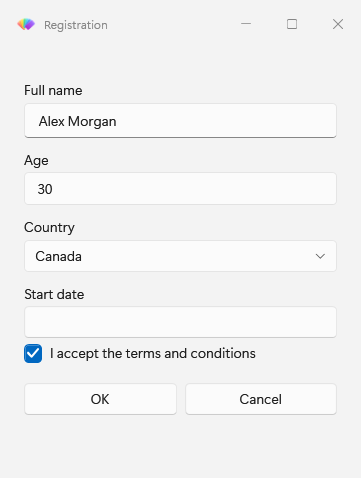
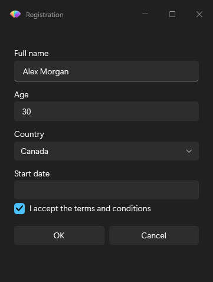
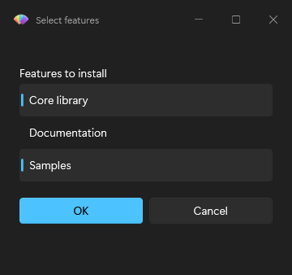
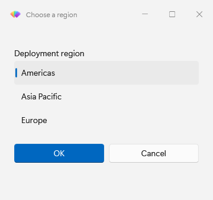
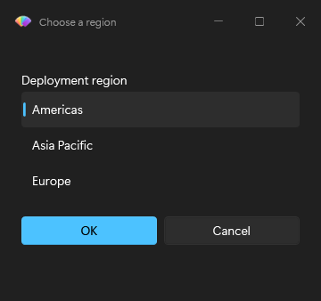

# Collect and validate input

Use `Get-FluenceInput` for one value and `Show-FluenceDialog` for a form. Both use the same prompt types described in the [input type reference](../reference/input-types.md).

## Collect one value

```powershell
$server = Get-FluenceInput -Title 'Connection' -Message 'Server name' -DefaultValue 'localhost'
if ($null -eq $server)
{
    return
}
```

Cancel, Esc, the title bar close button, and timeout return `$null`. Change `-InputType` to `Number`, `Password`, `Date`, `FileOpen`, or another supported type when text is insufficient. `Get-FluenceInput` does not accept `List`; use `Show-FluenceListSelection` for a standalone list.

## Collect several values

Create named prompts, then read their names from the `Fluence.DialogResult`:

```powershell
$prompts = @(
    New-FluencePrompt -Name Server -Message 'Server name' -ValidateNotEmpty
    New-FluencePrompt -Name Port -Message 'Port' -InputType Number -DefaultValue 443
    New-FluencePrompt -Name Region -Message 'Region' -InputType Choice -ValidateSet 'Americas', 'Europe', 'Asia' -DefaultValue 'Europe'
)
$result = Show-FluenceDialog -Title 'Connection' -Prompts $prompts -Buttons 'Connect', 'Cancel'
if ($result.Connect)
{
    "Use $($result.Server):$($result.Port) in $($result.Region)"
}
```

Prompt and button names must be unique without regard to case. `Cancelled`, `TimedOut`, and `PSTypeName` are reserved. A bare string prompt creates a text field with a generated `Input_` name, so use `New-FluencePrompt -Name` when scripts need the value.

## Reject invalid input

The form dialog is available in both captured themes.





Validation runs in prompt order when a non-cancel button is clicked. The first failure appears in an error InfoBar and keeps the dialog open. Cancel, Esc, and title bar dismissal bypass validation.

```powershell
$prompts = @(
    New-FluencePrompt -Name Email -Message 'Work email' -ValidateNotEmpty -ValidatePattern '^[^@\s]+@contoso\.com$'
    New-FluencePrompt -Name Port -Message 'Port' -InputType Number -ValidateScript { param($value) $value -ge 1 -and $value -le 65535 }
)
```

`-ValidatePattern` allows an empty value. Pair it with `-ValidateNotEmpty` to require one. A custom validator passes when its last output is truthy; an exception fails validation. On MTA hosts its scriptblock is recreated on the UI runspace, so keep it self-contained.

## Offer choices and lists

`Choice` requires `-ValidateSet` and renders a combo box by default. Add `-As Radio` for radio buttons. `List` also requires `-ValidateSet`; add `-MultiSelect` to return an array, including when only one item is selected.

```powershell
New-FluencePrompt -Name Edition -Message 'Edition' -InputType Choice -ValidateSet 'Standard', 'Pro' -As Radio
New-FluencePrompt -Name Features -Message 'Features' -InputType List -ValidateSet 'Core', 'Docs', 'Samples' -MultiSelect -ValidateNotEmpty
```

For a list without other fields:

```powershell
$features = Show-FluenceListSelection -Message 'Select features' -Items 'Core', 'Docs', 'Samples' -MultiSelect -DefaultValue @('Core')
if ($null -eq $features)
{
    return
}
```

The list command returns `$null` on cancel or timeout. An OK response requires at least one selection.

This capture shows multiple selected items.



## Collect paths, dates, and passwords

The standalone list selection dialog is also shown in both themes.





`FileOpen`, `FileSave`, and `FolderOpen` show a text box with a Browse button and return a path string. `Date` returns `DateTime` or `$null`; `Time` returns `TimeSpan` or `$null`. Numeric defaults are converted to `double` before the window opens.

`Password` uses the Fluence styled WPF `PasswordBox` and returns `SecureString` by default. Use the value with an API that accepts `SecureString`, then dispose it. Cancelled form results also contain captured secure values that need disposal.

```powershell
$result = Show-FluenceDialog -Title 'Sign in' -Prompts @(
    New-FluencePrompt -Name User -Message 'Account' -ValidateNotEmpty
    New-FluencePrompt -Name Pass -Message 'Password' -InputType Password -ValidateNotEmpty
) -Buttons 'Login', 'Cancel'
try
{
    if ($result.Login)
    {
        $credential = [System.Management.Automation.PSCredential]::new($result.User, $result.Pass)
        # Pass $credential to the intended command here.
    }
}
finally
{
    if ($result.Pass -is [System.Security.SecureString])
    {
        $result.Pass.Dispose()
    }
}
```

Password defaults must be strings and remain plaintext in the prompt specification. Secure password validation can check `Length` without decryption. `-ValidatePattern` for passwords requires explicit `-AsPlainText`. That switch also makes the returned value a plain string, so use it only for APIs that require one.

The default console view of a dialog result shows its outcome flags, while explicit property access and serialization can expose entered values. See [result objects](../reference/result-objects.md) for every property and value type.

## Command details

- [Get-FluenceInput](../reference/Get-FluenceInput.mdx), [New-FluencePrompt](../reference/New-FluencePrompt.mdx), and [Show-FluenceDialog](../reference/Show-FluenceDialog.mdx)
- [Show-FluenceListSelection](../reference/Show-FluenceListSelection.mdx)
- [Input types](../reference/input-types.md) and [result objects](../reference/result-objects.md)
