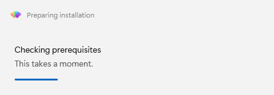
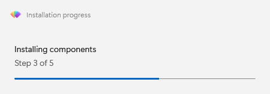
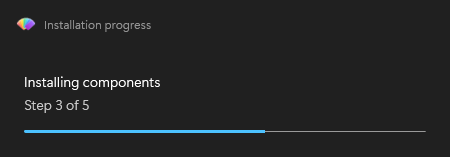

# Show progress during a long task

`Show-FluenceProgress` opens a non-modal window and returns a handle immediately. The window has a message, an optional detail line, and a progress bar. A script must close it; the user cannot.

## Open, update, and close

Keep the handle for every update and close the window in `finally`:

```powershell
$progress = Show-FluenceProgress -Title 'Setup' -Message 'Preparing' -Detail 'Step 1 of 3'
try
{
    # Do the first step here.
    Update-FluenceProgress -Handle $progress -Message 'Installing' -Detail 'Step 2 of 3'
    # Do the second step here.
    Update-FluenceProgress -Handle $progress -Message 'Finishing' -Detail 'Step 3 of 3'
}
finally
{
    Close-FluenceProgress -Handle $progress
}
```

Only one progress window may be open at a time. A second open call throws. Closing an already closed handle has no effect.

Set its title-bar text with `-Title` (also available as `-TitleBarText`) and its host icon with `-TitleBarIcon`, which accepts a local path, `file:` URI, or `pack:` URI. Progress does not expose `-ShowIcon`; that switch is available on `Show-FluenceWindow` to hide its built-in host icon. This window icon is separate from dialog body glyphs and images.

The next capture shows an indeterminate progress bar in light mode.



## Report measured progress

Progress windows in both captured themes:





The bar is indeterminate until `-PercentComplete` is supplied on the open or an update call. Values outside 0 to 100 are clamped. Switch back with `Update-FluenceProgress -Indeterminate`.

```powershell
$progress = Show-FluenceProgress -Message 'Copying files' -PercentComplete 0
try
{
    $files = @(Get-ChildItem -LiteralPath $source -File)
    for ($i = 0; $i -lt $files.Count; $i++)
    {
        Copy-Item -LiteralPath $files[$i].FullName -Destination $destination
        Update-FluenceProgress -Handle $progress -Detail $files[$i].Name -PercentComplete (100 * ($i + 1) / $files.Count)
    }
    Update-FluenceProgress -Handle $progress -Message 'Finishing' -Detail '' -Indeterminate
}
finally
{
    Close-FluenceProgress -Handle $progress
}
```

An empty `-Detail` hides that line. An omitted property keeps its current value.

## Keep an inline window responsive

On a calling STA thread, the progress window shares the script's dispatcher. A long operation that never yields or calls a module command can leave it looking frozen. Call `Update-FluenceProgress` during the work, including with no changed text when needed, to pump pending UI work.

```powershell
$job = Start-Job { Start-Sleep -Seconds 20 }
while ($job.State -eq 'Running')
{
    Update-FluenceProgress -Handle $progress
    Start-Sleep -Seconds 2
}
```

On an MTA caller, the module owns a separate STA UI runspace and its progress window paints between updates. Check `$progress.Mode` for `Inline` or `Runspace`. A modal dialog on the inline thread pauses progress painting until it closes.

## Position the window

Progress is centered and topmost by default. Use `-Position TopRight` or `BottomRight`, `-NotTopmost`, and `-Width` to adjust it. Width defaults to 450 device independent pixels.

```powershell
$progress = Show-FluenceProgress -Message 'Installing' -Position BottomRight -NotTopmost -Width 400
```

## Command details

- [Show-FluenceProgress](../reference/Show-FluenceProgress.mdx), [Update-FluenceProgress](../reference/Update-FluenceProgress.mdx), [Close-FluenceProgress](../reference/Close-FluenceProgress.mdx)
- [Progress handle fields](../reference/result-objects.md#fluenceprogresshandle)
- [UI threading](../explanation.md#where-the-ui-thread-comes-from)
