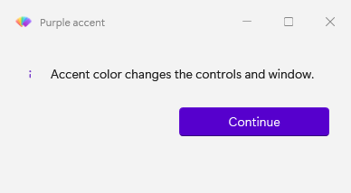
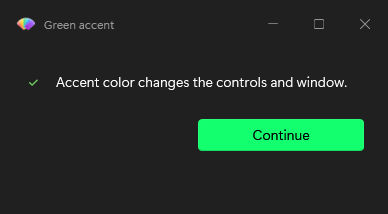

# Change theme, accent, and backdrop

Appearance settings belong to the WPF application in the current process. Set them before opening a window or change them while one is open.

## Set appearance when opening a window

Dialog commands accept `-Theme` and `-Backdrop`. `Show-FluenceDialog`, `Show-FluenceProgress`, and `Show-FluenceWindow` also accept `-Accent`.

```powershell
Show-FluenceMessage -Message 'Dark appearance' -Theme Dark -Backdrop None
Show-FluenceDialog -Message 'Branded prompt' -Prompts 'Name' -Accent '#C42B1C'
```

The accent accepts a WPF `Color` or a color string parsed by WPF. An appearance option is applied only when supplied; subsequent windows inherit current process state. The first Fluence call seeds `Auto`, `Mica`, and the system accent.

## Change the theme and accent

These captures show custom purple and green accent colors on module dialogs.





```powershell
Set-FluenceTheme -Theme Dark
Set-FluenceTheme -Theme Auto
Set-FluenceAccent -Color '#10893E'
Set-FluenceAccent -System
```

Themes are `Auto`, `Light`, `Dark`, and `HighContrast`. `Auto` follows Windows when a window is watching system changes. `-Color` pins a custom accent ramp until another accent request; `-System` restores the Windows accent. `Set-FluenceTheme -Theme Dark -Backdrop Acrylic` changes the requested theme and backdrop together. Omitting the backdrop retains its current value.

Open controls using dynamic resources reflect published theme and accent changes. `-UpdateAccent` on `Set-FluenceTheme` is accepted for compatibility and ignored because the theme engine retains its accent intent. These images show separate accent examples, not one dialog changing while open. The [capture notes](../images/CAPTURE.md) describe the render method and its limits, including the missing native DWM shadow and backdrop.

An open, realized `FluenceWindow` fades its previous WPF surface out over 167 ms for Light/Dark theme and accent changes. Resources, requested and resolved state, and public change events update immediately; the fade is a visual overlay. High Contrast entry or exit is immediate. The transition is skipped when motion is disabled, the window is minimized or not realized, or the surface cannot be captured. A regular WPF `Window` changes immediately. Native DWM backdrop pixels are outside the WPF snapshot and cannot be interpolated.

## Change a backdrop

```powershell
Set-FluenceBackdrop -Backdrop Acrylic
Set-FluenceBackdrop -Backdrop Mica -Window $Window
```

Without `-Window`, the new backdrop applies to later windows. In a `Show-FluenceWindow -Initialize` block, pass its `$Window` to change that open window. The window must belong to the Fluence UI thread. Mica and Tabbed require Windows 11; on Windows 10 they fall back to a solid background. Acrylic on Windows 10 uses legacy composition behavior and follows the Windows Transparency effects setting.

## Follow Windows changes

`Show-FluenceWindow -WatchSystemTheme` registers a watcher for that window. With the requested theme at `Auto`, switching the Windows Light or Dark setting changes the open window. The watcher is removed when it closes.

```powershell
Show-FluenceWindow -XamlPath (Join-Path $PSScriptRoot 'MainWindow.xaml') -WatchSystemTheme
```

Dialogs do not keep a system watcher after they close.

## Inspect current appearance

```powershell
$theme = Get-FluenceTheme
$theme.CurrentTheme
$theme.ResolvedTheme
$theme.CurrentBackdrop.ToString()
$theme.IsAppInDarkMode
```

`CurrentTheme` is the requested value; `ResolvedTheme` is what is displayed. Compare `CurrentBackdrop` by name because its enum type differs between library versions. See the [theme result reference](../reference/result-objects.md#fluencethemeinfo).

## React in application code

For a custom window whose icon or other local state needs to change, subscribe to `ApplicationThemeManager.Changed` inside `-Initialize` and unsubscribe when the window closes. The [appearance example](../../../Fluence.Wpf.PowerShell.Module/examples/04-ThemeAndAccent.ps1) shows the complete subscription and cleanup. Theme brushes usually need only `DynamicResource` in XAML; consult the [theme key catalogue](../../theming.md).

## Command details

- [Set-FluenceTheme](../reference/Set-FluenceTheme.mdx), [Set-FluenceAccent](../reference/Set-FluenceAccent.mdx), [Set-FluenceBackdrop](../reference/Set-FluenceBackdrop.mdx), [Get-FluenceTheme](../reference/Get-FluenceTheme.mdx)
- [Theme architecture](../explanation.md#theme-seeding-and-the-three-slots)
