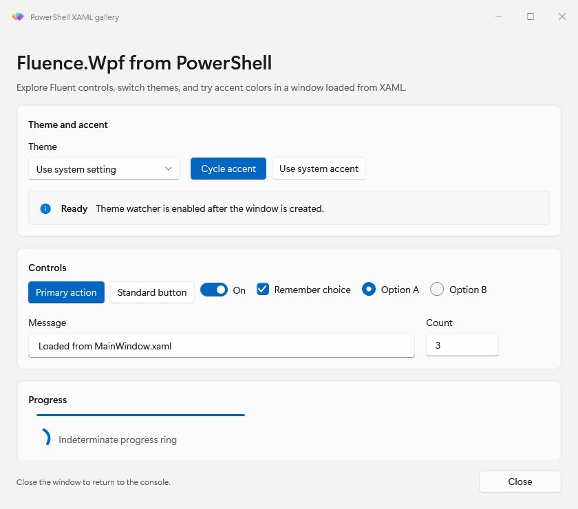
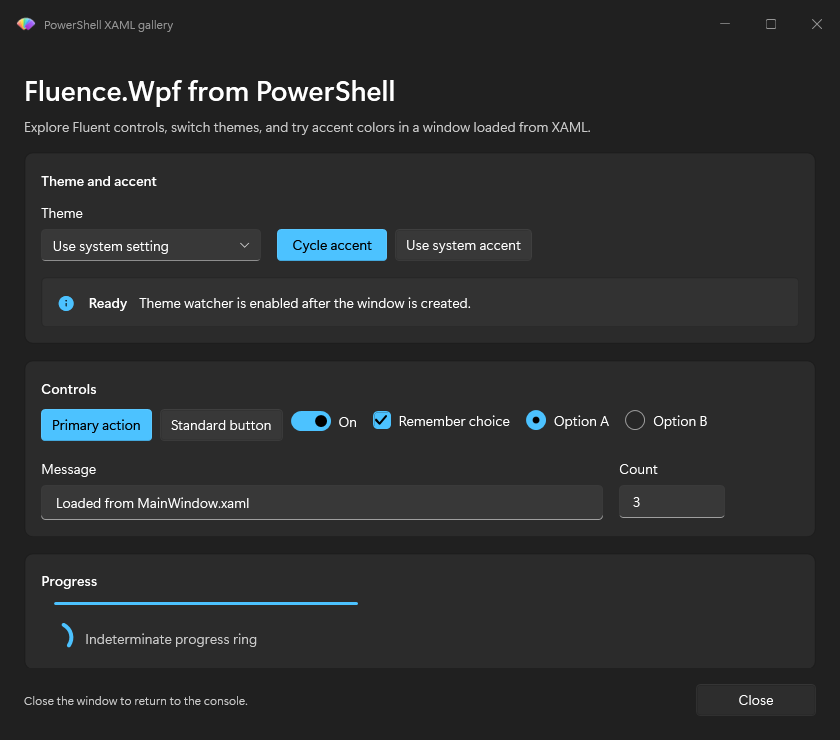

# Host a custom window from XAML

`Show-FluenceWindow` displays a XAML document or a window built in PowerShell. It handles library loading, the WPF application, and the modal window lifetime. Load only trusted XAML: `XamlReader` constructs objects and does not sandbox the document.

## Start with a XAML string

Declare the WPF and Fluence namespaces. A `fluence:FluenceWindow` root supplies Fluence window chrome; a non-window root is hosted in a new `FluenceWindow`.

```powershell
$xaml = @'
<fluence:FluenceWindow
    xmlns="http://schemas.microsoft.com/winfx/2006/xaml/presentation"
    xmlns:x="http://schemas.microsoft.com/winfx/2006/xaml"
    xmlns:fluence="http://schemas.fluencewpf.com"
    Title="Sample" Width="480" Height="240">
    <StackPanel Margin="24">
        <TextBlock Text="A PowerShell window" Foreground="{DynamicResource TextFillColorPrimaryBrush}" />
        <fluence:Button x:Name="CloseButton" Content="Close" Margin="0,16,0,0" />
    </StackPanel>
</fluence:FluenceWindow>
'@

Show-FluenceWindow -Xaml $xaml -Initialize {
    param($Window, $Data)
    $Window.FindName('CloseButton').add_Click({
        Close-FluenceWindow -Window $Window
    }.GetNewClosure())
}
```

The call blocks until the window closes. Use `DynamicResource` for theme colors and brushes so open controls can respond to theme and accent changes. See the [theme key catalogue](../../theming.md).

## Move layout into a file

The module can host XAML in a Fluence window in either theme.





Store a complete XAML document beside your script and pass its path. The [runnable example](../../../Fluence.Wpf.PowerShell.Module/examples/05-LoadXamlFile.ps1) loads [MainWindow.xaml](../../../Fluence.Wpf.PowerShell.Module/examples/MainWindow.xaml).

```powershell
Show-FluenceWindow -XamlPath (Join-Path $PSScriptRoot 'MainWindow.xaml') -WatchSystemTheme -Initialize {
    param($Window, $Data)
    # Find named controls and attach handlers here.
}
```

`-WatchSystemTheme` watches Windows theme changes while this window remains open. With the requested theme at `Auto`, an open window follows the Windows Light and Dark setting.

## Attach handlers and retain state

`-Initialize` receives the window and the `-Data` hashtable. Find controls by `x:Name`, then attach handlers through `add_<Event>`. Capture local variables with `.GetNewClosure()`.

```powershell
Show-FluenceWindow -Xaml $xaml -Data @{ Clicks = 0 } -Initialize {
    param($Window, $Data)
    $button = $Window.FindName('CloseButton')
    $button.add_Click({
        $Data.Clicks++
        Close-FluenceWindow -Window $Window -Result $Data.Clicks
    }.GetNewClosure())
}
```

On an MTA caller, `-Initialize`, `-Content`, and event handlers run in a module-owned STA runspace. They cannot read caller variables or functions. Pass state through `-Data` and keep callbacks self-contained. On an inline STA caller, they run on the caller's WPF thread. See [UI threading](../explanation.md#where-the-ui-thread-comes-from).

## Return a result

`Close-FluenceWindow -Result <value>` stores a value before closing. `Show-FluenceWindow` returns that value; a title bar close returns `$null`. Add `-PassThru` to return a `Fluence.WindowResult` with `Result` and `Closed` properties.

```powershell
$outcome = Show-FluenceWindow -Xaml $xaml -PassThru -Initialize {
    param($Window, $Data)
    $Window.FindName('CloseButton').add_Click({
        Close-FluenceWindow -Window $Window -Result 'Done'
    }.GetNewClosure())
}
$outcome.Result
```

## Configure the window

When the root is a non-window element, use `-Title`, `-Width`, `-Height`, and the chrome options on `Show-FluenceWindow`. These options also apply to a `FluenceWindow` root. Common options include `-Topmost`, `-ResizeMode`, `-SizeToContent`, `-StartupLocation`, `-CornerStyle`, and switches for title and caption buttons.

Set the host title-bar text with `-Title` (also available as `-TitleBarText`) and its icon with `-TitleBarIcon`. The icon accepts a local path, `file:` URI, or `pack:` URI. `-ShowIcon:$false` hides the built-in host icon. When you supply a custom `TitleBar` or set `-ExtendsContentIntoTitleBar`, the built-in title-bar icon and text are hidden so the custom title-bar content can take their place. For a XAML `FluenceWindow` root, these parameters configure its host window icon and title-bar text.

```powershell
Show-FluenceWindow -Xaml $xaml -Title 'Setup' -TitleBarIcon "$PSScriptRoot\assets\app.ico" -ResizeMode NoResize -CornerStyle RoundSmall -NoMaximizeButton
```

`-Owner` works when the owner is on the Fluence UI thread. A cross-thread owner on an MTA host produces a warning and the new window appears without a parent.

Use `-Content { param($Window, $Data) ... }` when building the body in PowerShell rather than XAML. The block must set `$Window.Content` and can attach handlers in the same way as `-Initialize`.

## Command details

- [Show-FluenceWindow](../reference/Show-FluenceWindow.mdx) and [Close-FluenceWindow](../reference/Close-FluenceWindow.mdx)
- [Change appearance](theming-at-runtime.md) for a live window backdrop
- [Examples catalogue](../../../Fluence.Wpf.PowerShell.Module/examples/README.md) for complete window scripts
