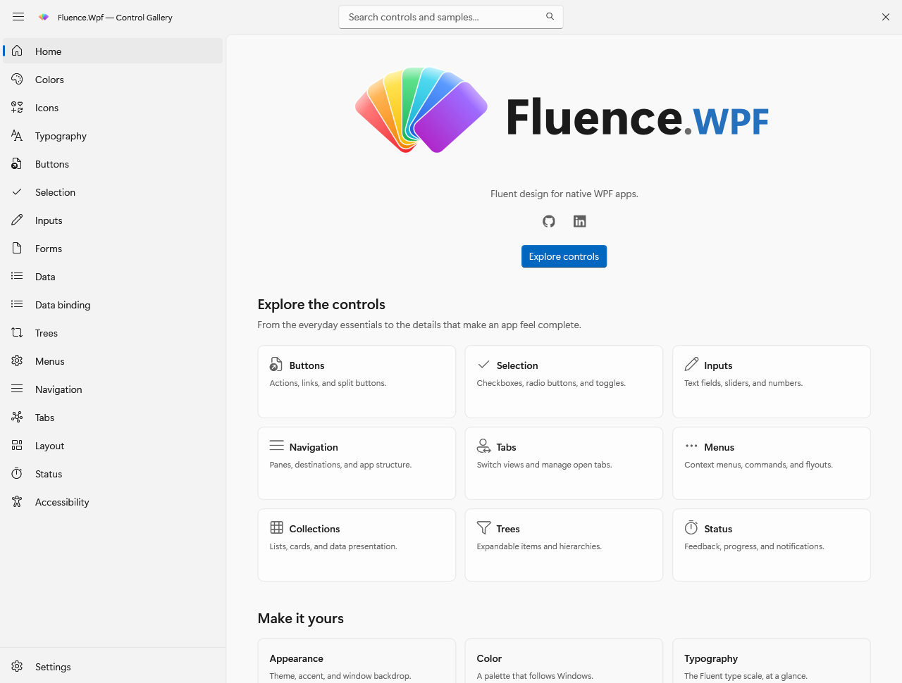
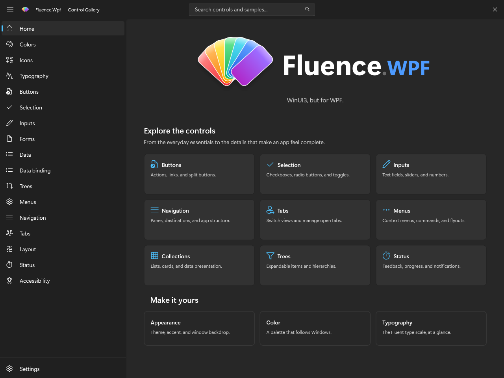
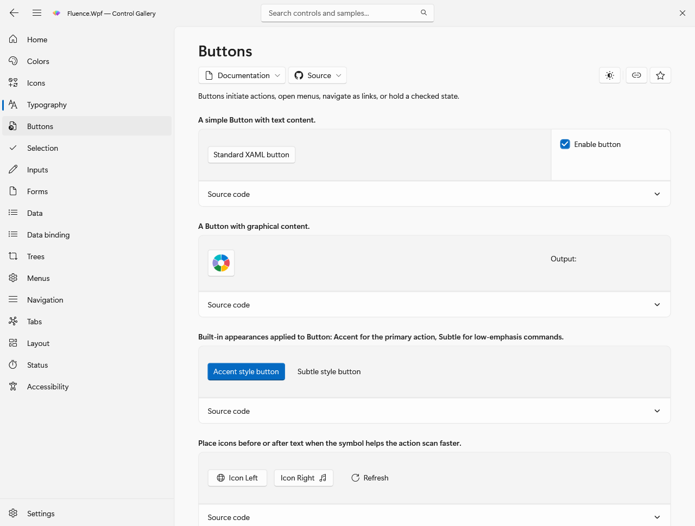
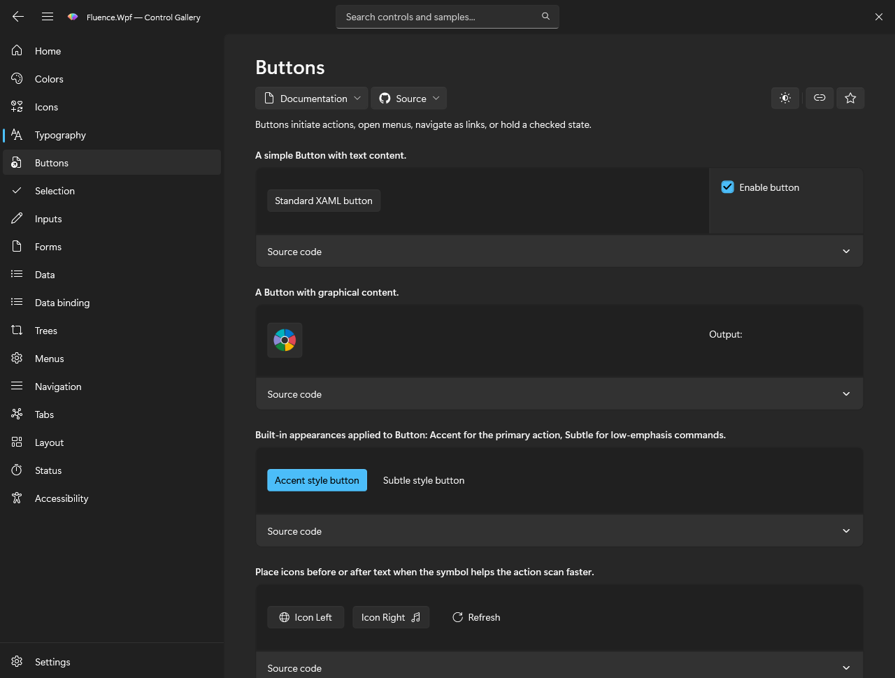
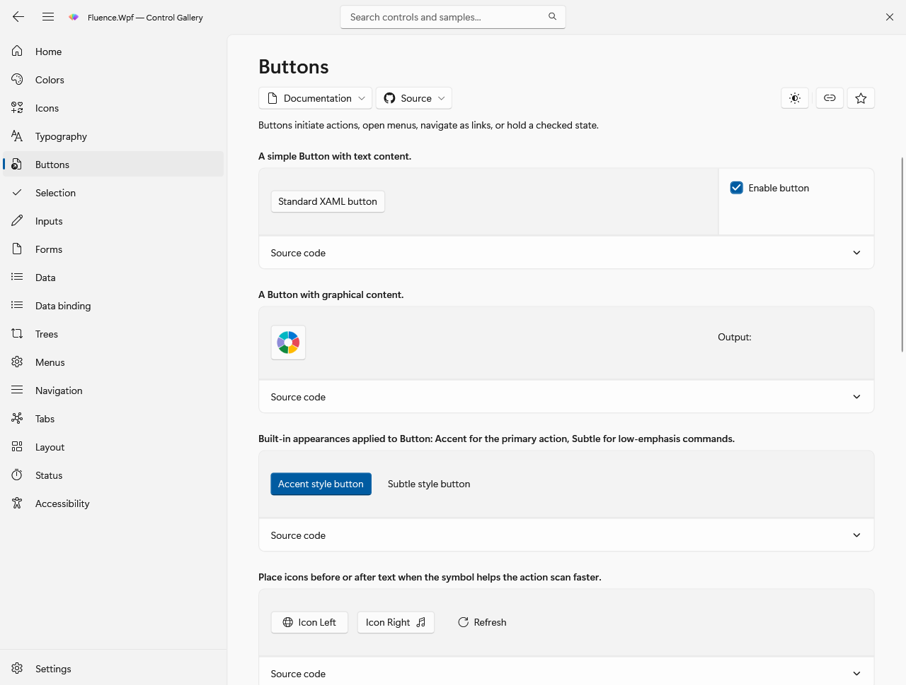
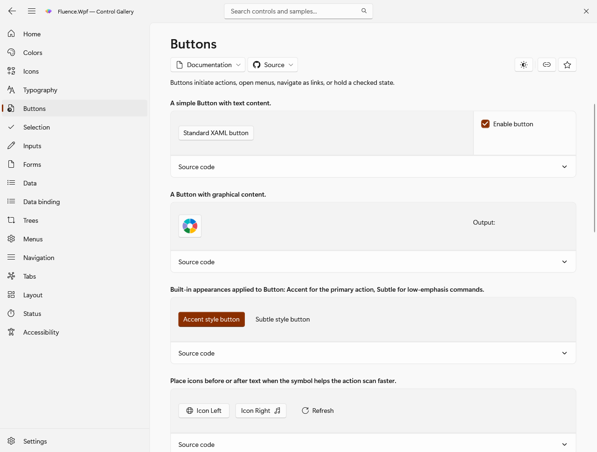

# Theme Resources and publication

This page covers the keys an application can consume and how the theme engine updates them. For a first app, begin with the [Basic walkthrough](https://fluencewpf.com/docs/csharp/usage).

This page is the supported resource-key reference for Fluence.Wpf. Use it when styling application content or writing a control template. The complete, build-checked key inventory is [`PublicKeys.txt`](../Fluence.Wpf.Tests/Theming/golden/PublicKeys.txt); the families below explain how to use those keys.

## Initialize and consume resources

Call `ApplicationThemeManager.Apply` before showing the first window. It creates a resource dictionary with colors and brushes, then loads typography and control templates. Theme and accent updates replace the computed dictionary, so use `DynamicResource` for live values:

```xml
<Border Background="{DynamicResource CardBackgroundFillColorDefaultBrush}"
        BorderBrush="{DynamicResource CardStrokeColorDefaultBrush}"
        CornerRadius="{DynamicResource OverlayCornerRadius}" />
```

Each published color normally has a frozen `SolidColorBrush` sibling with `Brush` appended. Use the brush key for brush properties. Some special brush keys have no color sibling, and a few accent brushes intentionally differ from the same-named color's direct conversion. Consult the frozen inventory for exact spelling.

When a visible, realized `FluenceWindow` changes between Light and Dark, changes accent, or changes its backdrop request, its previous WPF surface fades away over the new appearance for 167 ms. Theme and accent resources, manager state, and public change events update immediately; the fade is a temporary visual overlay, not interpolated brushes. Windows draws native DWM backdrops outside WPF, so those pixels do not interpolate. High Contrast entry or exit is immediate for accessibility. The fade is skipped when motion is disabled or a usable snapshot cannot be captured. Ordinary WPF `Window` instances update immediately.

## Supported key families

| Family | Examples | Use |
| --- | --- | --- |
| Text | `TextFillColorPrimaryBrush`, `TextFillColorSecondaryBrush`, `TextOnAccentFillColorPrimaryBrush`, `AccentTextFillColorPrimaryBrush` | Body text, secondary text, text on accent, and accent text |
| Controls | `ControlFillColorDefaultBrush`, `ControlFillColorSecondaryBrush`, `ControlFillColorInputActiveBrush`, `ControlFillColorDisabledBrush` | Control surfaces in normal and active states |
| Alternate and subtle fills | `ControlAltFillColorSecondaryBrush`, `ControlAltFillColorTertiaryBrush`, `SubtleFillColorSecondaryBrush` | Tracks, passive fills, and low emphasis states |
| Shared accent fills | `AccentFillColorDefaultBrush`, `AccentFillColorSecondaryBrush`, `AccentFillColorTertiaryBrush`, `AccentFillColorDisabledBrush` | Accent surfaces in Light and Dark; neutral window surfaces in High Contrast |
| Button accent states | `AccentButtonBackgroundBrush`, `AccentButtonBackgroundPressedBrush`, `ToggleButtonBackgroundCheckedBrush`, `SplitButtonBackgroundCheckedBrush` | Button, drop down, split, and toggle split templates |
| Other control accent states | `CheckBoxCheckBackgroundFillCheckedBrush`, `RadioButtonOuterEllipseCheckedFillBrush`, `ToggleSwitchFillOnBrush`, `SliderTrackValueFillBrush`, `HyperlinkButtonForegroundBrush` | Checked, selected, and linked control states with their own High Contrast roles |
| Strokes and focus | `ControlStrokeColorDefaultBrush`, `ControlStrongStrokeColorDefaultBrush`, `CardStrokeColorDefaultBrush`, `SurfaceStrokeColorDefaultBrush`, `DividerStrokeColorDefaultBrush`, `FocusStrokeColorOuterBrush`, `FocusStrokeColorInnerBrush` | Edges, dividers, and focus visuals |
| Background and layers | `ApplicationBackgroundBrush`, `SolidBackgroundFillColorBaseBrush`, `LayerFillColorDefaultBrush`, `CardBackgroundFillColorDefaultBrush` | Page, layer, and card surfaces |
| Status | `SystemFillColorSuccessBrush`, `SystemFillColorCautionBrush`, `SystemFillColorCriticalBrush`, `SystemFillColorAttentionBrush`, `SystemFillColorNeutralBrush` | Feedback and severity surfaces |
| Accent ramp | `SystemAccentColor`, `SystemAccentColorLight1` through `Light3`, `SystemAccentColorDark1` through `Dark3` | Raw Windows or custom accent ramp |
| Theme-resolved accent | `SystemAccentColorPrimary`, `SystemAccentColorSecondary`, `SystemAccentColorTertiary`, and brush variants | Accent roles selected for the resolved theme |
| Chrome | `TitleBarActiveColor`, `TitleBarInactiveColor`, `WindowBorderColor`, and brush variants | WPF window frame |

The named families contain more keys than the examples shown. The public inventory also includes the `ControlOnImageFillColor*`, `LayerOnMicaBaseAltFillColor*`, acrylic, card, background, and InfoBadge foreground families. `AcrylicBackgroundFillColorDefaultBrush` and `AcrylicBackgroundFillColorBaseBrush` provide painted fallbacks for transient surfaces. `AccentAcrylicBackgroundFillColor*` supplies accent tinted variants. WPF does not offer WinUI's per-element backdrop blur, so these resource values describe a flat surface.

### High contrast roles

These brush-only keys map to live WPF `SystemColors` when high contrast resources are published:

`SystemColorWindowTextColorBrush`, `SystemColorWindowColorBrush`, `SystemColorButtonFaceColorBrush`, `SystemColorButtonTextColorBrush`, `SystemColorHighlightColorBrush`, `SystemColorHighlightTextColorBrush`, `SystemColorHotlightColorBrush`, and `SystemColorGrayTextColorBrush`.

The InfoBadge foreground family also changes with high contrast. Use the published role keys instead of hard-coded colors. A settings broadcast causes the theme engine to read a new `SystemColors` snapshot.

In high contrast, WinUI's shared `AccentFillColor*` brushes use the live window color, while `AccentTextFillColor*` and `TextOnAccentFillColor*` use window text; disabled text uses gray text. Interactive controls use separate state resources for highlight, hover, pressed, and disabled visuals. Brush-only roles such as `SystemControlHighlightAccentBrush` and `TextControlSelectionHighlightBrush` also follow the live highlight color. Fluence publishes these resources in the computed dictionary so existing controls and custom templates update when the Windows contrast scheme changes. The raw `SystemAccentColor` ramp remains available for inspection and custom accent intent, but does not determine high-contrast control states.

CheckBox publishes separate `CheckBoxCheckBackgroundFillIndeterminate*` plate and `CheckBoxCheckGlyphForegroundIndeterminate*` dash families. Each has base, `PointerOver`, `Pressed`, and `Disabled` color keys with brush twins. In High Contrast, the plate uses Highlight, HighlightText, Highlight, and GrayText in that order; the dash uses HighlightText, Highlight, HighlightText, and Window. In Light and Dark, these roles use the same accent and on-accent values as the corresponding checked states. Custom templates should use the indeterminate keys when the high-contrast distinction matters.

### Typography, geometry, and motion

`Themes/Typography/Typography.xaml` publishes `CaptionTextBlockStyle`, `BodyTextBlockStyle`, `BodyStrongTextBlockStyle`, `BodyLargeTextBlockStyle`, `SubtitleTextBlockStyle`, `TitleTextBlockStyle`, `TitleLargeTextBlockStyle`, and `DisplayTextBlockStyle`. It also publishes `ContentControlThemeFontFamily`.

Supported radii include `ControlCornerRadius` (4), `OverlayCornerRadius` (8), `ComboBoxItemCornerRadius` (3), and `PopupCornerRadius`. Motion tokens include `ControlFasterAnimationDuration` (83 ms), `ControlFastAnimationDuration` (167 ms), `ControlNormalAnimationDuration` (250 ms), and `ControlFastOutSlowInKeySpline`. `ControlPressAnimationDuration` (100 ms) and `ControlSlowAnimationDuration` (333 ms) are Fluence extensions of the naming pattern.

`FlyoutShadowEffect` is a shared WPF fallback for transient surfaces. It uses a fixed black shadow with blur radius 18, opacity 0.22, direction 270 degrees, and depth 4. WinUI's `ThemeShadow` varies with theme and semantic elevation; WPF's `DropShadowEffect` does not reproduce that compositor behavior. Treat this value as an approximation. In custom templates, place it on an empty sibling behind the text surface so WPF text rendering is not affected by an `Effect` ancestor. See [parity boundaries](winui-parity.md#color-alpha-and-elevation-fidelity).

### Supported aliases

`FluentFontFamily` aliases `ContentControlThemeFontFamily`. `ApplicationPageBackgroundThemeBrush` aliases `ApplicationBackgroundBrush`. Both names in each pair are supported; prefer the WinUI-style name in new code where it conveys the same intent. The eight `SystemColor*Brush` values above are platform role aliases rather than aliases of another Fluence key.

## How theme publication works

`ApplicationThemeManager.Apply` resolves a concrete Light, Dark, or High Contrast theme. The engine resolves the system or selected accent, combines theme and accent colors, creates frozen brush values, and replaces the computed resource dictionary. A fingerprint of the published output avoids rebuilding resources for repeated Windows settings broadcasts that change nothing. It also accounts for high contrast system colors and the transparency setting.

The dictionaries are installed in the following order. Because slot `[0]` is replaced, existing `DynamicResource` and `{fluence:ThemeResource}` consumers receive the new values. Typography and templates are loaded once. Theme state and events update as the engine publishes; a visible `FluenceWindow` may show a short WPF surface fade over the new resources. High Contrast changes apply immediately. Native DWM backdrop pixels are outside that WPF transition.

## Resource ownership and lookup

After initialization, `Application.Current.Resources.MergedDictionaries` has three Fluence slots:

| Slot | Content | Update behavior |
| --- | --- | --- |
| `[0]` | Computed colors, brushes, and special brush roles | Replaced when published output changes |
| `[1]` | `Themes/Typography/Typography.xaml` | Loaded once |
| `[2]` | `Themes/Generic.xaml` | Loaded once |

The per-theme `Themes/Colors/Theme.*.xaml` files are color tables read by the engine, not dictionaries to merge into an application. Never merge `Generic.xaml` manually after calling the theme manager. The [pipeline explanation](explanation/theme-pipeline.md) traces resolution and publication.

Only the computed keys, typography keys, and the two focus styles `DefaultControlFocusVisualStyle` and `DefaultCollectionFocusVisualStyle` are supported app resources. `Generic.xaml` merges control-template dictionaries whose other `x:Key` entries are implementation details. The computed control accent state keys describe WinUI roles used by Fluence templates; changing one globally affects every consumer of that key. Replace a template to restyle only one control.

The color keys `SystemAccentColorPrimary`, `Secondary`, and `Tertiary` express theme-resolved roles. Their brush names are not always direct color twins: the engine deliberately publishes different ramp shades for some brush roles. Bind the specific resource whose value type and role you need.

## Theme-aware markup

`{fluence:ThemeResource Key}` is a WPF `DynamicResource`-based way to make WinUI-style theme intent explicit. It refreshes when the engine publishes new resources. App-authored per-theme values can be placed in `ThemeDictionary` with `ThemeResourceDictionary` tables keyed `Light`, `Dark`, or `HighContrast`. Use `DynamicResource` or `ThemeResource` to consume those values. See the XML documentation in [`ThemeDictionary.cs`](../Fluence.Wpf/Markup/ThemeDictionary.cs) for an XAML example and fallback behavior.

## Accent, backdrop, and design time

The system accent is the default intent. `ApplyCustomAccent` pins one seed or separate light and dark seeds. When a seed exactly matches the current Windows accent base and the OS palette is available, Fluence snapshots all seven Windows shades for that custom intent; the pinned snapshot stays fixed if Windows later changes. Other custom seeds use a generated ramp. The visible primary accent fill uses a theme-selected shade of the selected palette, so an arbitrary seed is not guaranteed to appear unchanged on a button. Because Windows may adjust a requested seed before constructing its palette, generated `Light1` through `Light3` and `Dark1` through `Dark3` are not guaranteed to fall above or below the raw `SystemAccentColor`; that published color remains the requested seed. The generated ramp is an approximation of Windows behavior for arbitrary custom colors, not a proven exact Windows color transform. `ApplySystemAccent` returns to the live Windows palette.

Use `ApplyCustomAccentExact` when the visible primary fill must equal a supplied color. The one-color overload makes `AccentFillColorDefault` and `SystemAccentColorPrimary` equal the light color in Light mode and uses the resolved palette's `Light2` tint in Dark mode. That palette is a Windows snapshot if the seed matches the current Windows base, or a generated fallback otherwise. The two-color overload makes those roles equal the supplied light and dark colors respectively. Both forms keep the selected palette for other accent roles, and the selection remains sticky across theme changes. For example:

```csharp
using System.Windows.Media;
using Fluence.Wpf;

Color light = Color.FromRgb(0x87, 0xAB, 0xC8);
Color dark = Color.FromRgb(0xAC, 0xCB, 0xDF);

ApplicationAccentColorManager.ApplyCustomAccent(light);            // OS snapshot if the seed matches; otherwise generated.
ApplicationAccentColorManager.ApplyCustomAccent(light, dark);      // Select the matching snapshot or generated ramp per theme.
ApplicationAccentColorManager.ApplyCustomAccentExact(light);       // Exact Light fill, resolved Dark Light2 tint.
ApplicationAccentColorManager.ApplyCustomAccentExact(light, dark); // Exact Light and Dark fills.
ApplicationAccentColorManager.ApplySystemAccent();                 // Follow Windows again.
```

High Contrast control fills and text continue to follow live `SystemColors` roles, even with an exact custom accent. The raw `SystemAccentColor` remains the selected ramp seed. `FluenceWindow` uses backdrop policy independently of these color tokens; see [window configuration](how-to/window-and-title-bar.md).

The XAML designer cannot run the full theme engine. The library includes generated Light and Dark design-time resource dictionaries under `Fluence.Wpf/Properties/`, plus `DesignTimeResources.xaml` for default preview. These are snapshots for the designer and are not merged at runtime. Check the final appearance in the gallery, especially high contrast and DWM surfaces.

## Gallery appearance examples

These captures demonstrate the gallery's light and dark appearance. They show the system accent in the captured environment; the controls use the shared accent resources described above.





The button samples also show themed control surfaces and accent styling:





The gallery can pin a custom accent independently of the light or dark theme. These captures show the same button page with blue and orange accent ramps.





The [screenshot manifest](screenshots/gallery/manifest.json) lists the captured routes and states. It records that offscreen WPF rendering omits native DWM backdrops and shadows.
